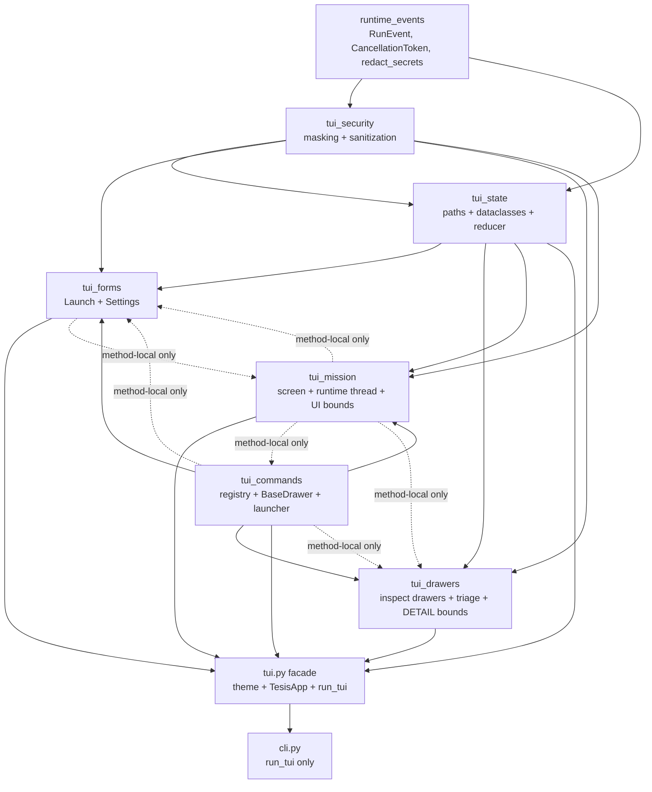

# Handoff — TUI module split (2026-09-22)

Status: `docs/completed/`. Implementation and §12 acceptance checks passed.

Behavioral source of truth (do not re-derive behavior here):

- `docs/completed/HANDOFF_TUI_MISSION_CONTROL_REDESIGN_2026-09-21.md` (canonical plan)
- `docs/completed/HANDOFF_TUI_MISSION_CONTROL_CONTINUATION_2026-09-22.md` (38/38 DONE)
- `docs/completed/HANDOFF_TUI_REVAMP_2026-09-19.md`, `HANDOFF_AI_HARNESS_ARCHITECTURE_TUI_2026-09-19.md`, `HANDOFF_BREAKING_CHANGE_REGRESSION_2026-09-20.md`
- `AGENTS.md` (docs lifecycle, runtime/state/AKG/containment rules)

Scope: move-only split of `tesis/tui.py` (3,589 lines, ~145 KB) into 6 owning
modules + thin facade. No behavior, visual, or contract change.

## 1. Problem / evidence

`tesis/tui.py` is the only file in the repo that mixes six unrelated reasons to
change: secret redaction, pure event reduction, command registry, config write
surfaces, read-only inspect surfaces, and the live runtime screen. Evidence:

- One file, 3,589 lines; symbol inventory spans `tui.py:60` (`REPOSITORY_ROOT`)
  to `tui.py:3589` (`__all__`). A config-masking fix (`_mask_yaml_secrets:112`),
  a reducer fix (`_apply_event:550`), and a drawer fix (`ResultsDrawer:2135`)
  all collide on the same file.
- Production import surface is tiny — only `tesis/cli.py:312-315`
  (`from tesis.tui import run_tui`) — but the test surface is wide:
  `tests/test_tui.py` (3,225 lines, `from tesis import tui` + `_require(name)`
  getattr) and `tests/test_cli.py` (`import tesis.tui as tui`) reach deep into
  private names and patch facade globals (see §8).
- The 2026-09-22 closeout is green: focused TUI suite 127 passed, runner
  contract 18 passed, dry run 4 coordinates, full suite 1558 passed. Any split
  that breaks that baseline for structural reasons is a regression, not progress.
- A two-module extraction (secrets + state only) leaves ~2,900 lines in
  `tui.py` and does not answer the maintainability complaint: drawers, mission
  screen, and runtime thread stay tangled. The endpoint below leaves the facade
  at ~150–200 lines and every other module with exactly one reason to change.

Line counts in this document are **diagnostic, not a rigid cap**. Expected sizes
are rough conservation checks (±30% is fine); the invariant is one reason to
change per module, zero duplicated definitions, zero shims.

## 2. Goals

1. Six owning modules + thin `tesis/tui.py` facade; every symbol defined once.
2. Preserve the exact public contract: `__all__` names, object identity,
   `TesisApp` behavior, `run_tui`, `CONFIG_PATH`, theme/`NO_COLOR`, `tui.tcss`
3. Top-level import direction is a DAG with no cycles (method-local references in §6 are runtime-only and exempt); Textual/config/artifact/runner imports live only where needed (see §6).
4. Each phase independently green and revertible; each phase migrates every
   caller and test in the same change and deletes the old definition.
5. No visual, runtime, redaction, cancellation, or artifact behavior change.

## 3. Non-goals

- No CSS/selector/visual redesign. One `tesis/tui.tcss`, untouched.
- No dependency or framework change (Textual stays; no Ink/OpenTUI migration).
- No new event model, presenter/`ActivityEntry` layer, abstract base hierarchy,
  factories, plugin system, or per-drawer modules (11 drawers stay in 2 files).
- No checkpoint/retry/prompt/scoring/graph migration.
- No new public API. No legacy-shell resurrection (`new_shell`,
  `TESIS_NEW_SHELL`, legacy screens stay deleted).
- Full 210-capture regeneration and live DVWA run are NOT gates for a
  move-only split (see §11).

## 4. Current responsibility map (exact clusters, `tesis/tui.py`)

All line numbers against the 3,589-line baseline (`[tui.py#71F1]`):

| Region | Lines | Symbols |
|---|---|---|
| Package header / imports | 1–61 | `REPOSITORY_ROOT:60`, `CONFIG_PATH:61`; imports `textual.*`, `evaluation.multi_llm_runner.run_provider_matrix`, `evaluation.runner.run_single_engagement`, `tesis.artifact_repository` (`ArtifactRepository`, `config_fingerprint`, `new_execution_id`), `tesis.config_loader` (6 names), `tesis.config_fields` (`ALL_FIELD_SPECS`, `REASONING_EFFORT_CHOICES`), `tesis.runtime_events` (`CancellationToken`, `RunEvent`, `redact_secrets`) |
| Theme | 64–88 | `_build_mono_theme:66`, `SHELL_MONO_THEME:87`, `SHELL_MONO_THEME_NAME:88` |
| Security / masking | 91–268 | `_safe_config_error_text:93` (function-local `from tesis.doctor import sanitize_config_error`), `_contains_literal_secret:100`, `_mask_yaml_secrets:112` (+nested `visit:117`), `_restore_yaml_secrets:136`, `_sanitize_endpoint:148` (+nested `_scrub:163`), `_safe_url:185`, `_failure_mapping:197`, `_mask_url_credentials:215`, `_redact_mapping:237`, `_SECRET_TOKEN:249`, `_SECRET_ASSIGNMENT:252`, `_redact_text:258`, `_invoke_runner:270` stays with mission (see §5) |
| Bounds / constants | 281–326 | `DETAIL_LOG_MAX_LINES:281`, `DETAIL_RENDER_MAX_CHARS:282`, `UI_PENDING_EVENT_MAX:284`, `NOTICE_MAX_ENTRIES:285`, `NOTICE_PANE_MAX:288`, `TRACE_MAX_ENTRIES:289`, `_DROP_COT_KEYS:291`, `CANONICAL_STAGE_IDS:302`, `_DIRTY_REGIONS:312`, `_TERMINAL_EVENT_TYPES:316`, `_FINAL_STATUSES:323`, `_FINAL_COORDINATE_STATUSES:326` |
| Pure state + reducer | 329–765 | `StageRow:330`, `CoordinateRow:338`, `FailureSummary:361`, `TuiRunState:370` + `__post_init__:400`, `_fresh_stages:408`, `_push_notice:412`, `_stage_for_node:441`, `_ensure_coordinate:461`, `_row_failed:473`, `_format_elapsed:479`, `_coordinate_elapsed:487`, `_failure_summary_from_data:507`, `_advance_run_elapsed:518`, `apply_run_event:536`, `_apply_event:550–765`; `RunStatus`/`StageStatus` literals ~299–300 |
| Command registry / floor | 768–848 | `CommandSpec:771`, `COMMANDS:783–799` (15 specs), `_COMMAND_INDEX:801`, `NAVIGATION_KEYS:805`, `navigation_hint:815`, `FLOOR_WIDTH:822`, `FLOOR_HEIGHT:823`, `_below_floor:826`, `_dismisses_below_floor:834` |
| Drawer shell + launcher | 852–1061 | `BaseDrawer:852` (`__init_subclass__:872`, `composed:876`, `mounted:893`, `resized:904`, `action_back:913`), `CommandLauncher:917` (`_run_active:944`, `_enabled:948`, `_option:955`, `_refilter:963`, `filter_commands:975`, `dispatch_typed:979`, `dispatch_selected:988`, `_dispatch:991` + `push:998`, `_return_to_mission:1040`, `_mission:1051`, `action_back:1057`) |
| Launch tables/helpers | 1063–1171 | `_LAUNCH_SCOPE_FIELDS:1063`, `_LAUNCH_COORDINATE_FIELDS:1064`, `_LAUNCH_MATRIX_FIELDS:1067`, `_LAUNCH_RUNTIME_FIELDS:1070`, `_LAUNCH_GUARDRAIL_SPECS:1081`, `_LAUNCH_GUARDRAIL_LABELS:1087`, `_LAUNCH_VALUE_ATTRS:1094`, `_LAUNCH_CLI_KEYS:1105–1132`, `_launch_field_id:1135`, `_launch_field_value:1140`, `_role_attr:1155`, `_matrix_coordinate_count:1161` |
| `LaunchDrawer` | 1173–1512 | `__init__:1183`, `_raw_config:1207`, `_field_control:1214`, `_yield_step:1244`, `compose:1249`, `_profile_names:1307`, `on_mount:1313`, `_widget_value:1319`, `_cli_args:1336`, `_resolved_config:1381`, `_goto_step:1386`, `next_step:1409`, `previous_step:1413`, `target_edited:1417`, `refresh_review:1449`, `_render_review:1452`, `close_drawer:1486`, `start_from_review:1490` (method-local `MissionControlScreen` lookup:1504), `prepare_shutdown:1511` |
| `SettingsDrawer` | 1515–1679 | `__init__:1516` (`preserved_secret_placeholders`, `literal_warning_acknowledged`, `_settings_generation`), `compose:1523`, `on_mount:1538`, `_set_section:1559`, `_render_sections:1565`, `_set_status:1614`, `save_settings:1621` (temp-file validation:1654, `save_yaml_config:1664`), `prepare_shutdown:1677` |
| Inspect drawers | 1682–2050 | `CoordinateDrawer:1682`, `EvidenceDrawer:1816`, `FailureDrawer:1893`, `TraceDrawer:1972` (each with `compose`/`on_mount`/`prepare_shutdown` + generation guard) |
| Triage helpers | 2053–2133 | `_TRIAGE_SCORE_FIELDS:2053`, `_nested_scores:2062`, `_score_text:2067`, `_joined:2082`, `_count_text:2089`, `_payload_text:2099`, `_STACKED_FILTER_WIDTH:2106`, `_stack_filter_row:2109` (panel-width, not screen-width) |
| `ResultsDrawer` | 2135–2420 | Full scan/detail/export surface (`_output_dir:2191`, `_scan_rows:2208`, `_triage_fields:2324`, `_show_detail:2377`, `export_triage:2397`, `_scan_generation`) |
| `DoctorDrawer` | 2423–2525 | `_config:2448`, `_start_checks:2451`, `_run_checks:2460`, `run_offline_pressed:2509`, `run_live_pressed:2514`, `_doctor_generation` |
| `PlanDrawer:2528`, `HelpDrawer:2584`, `AboutDrawer:2607` | 2528–2628 | Small read-only drawers; `HelpDrawer.ALLOW_BELOW_FLOOR=True` |
| Mission helpers | 2632–2723 | `_STAGE_GLYPH:2632`, `_STATUS_GLYPH:2634`, `_RUN_STATUSES:2637`, `_TOO_SMALL_FOOTER:2639`, `_FOOTER_*` tables:2645–2651, `_NARROW_STAGE_LABELS:2655`, `_cell:2662`, `_clip:2668`, `_command_hints:2676`, `_nav_hint:2685`, `_target_host:2690`, `MissionPane:2697`, `NoticeBody:2708` (`__init__:2716`, `watch_scroll_y:2720`) |
| `MissionControlScreen` | 2725–3510 | `BINDINGS:2726`, `__init__:2746` (state, token, thread, queue, lock, observers, notice-follow), `compose:2772` (canonical DOM order), `_footer_text:2791`, `on_mount:2817` (9-column `DataTable`), `on_resize:2829`, `on_screen_resume:2835`, `_restore_default_focus:2840`, `_dims:2850`, `_update_responsive_layout:2857` (wide/standard/narrow/too-small), renderers `2898–3193`, `_resolved_config:3168`, runtime `start_run:3196` (+`_start_run:3212` alias), `_open_journal:3214`, `_open_descriptor:3224`, `_close_descriptor:3233`, `_run_blocking:3244` (`forward:3248`, `_Sink:3254`, `terminal_seen` reconciliation:3302–3312), `_append_journal_terminal:3315`, `_post_event:3324`, observer registry:3343–3358, `_drain_runtime_events:3360`, `request_cancel:3380`, `prepare_shutdown:3388`, `on_unmount:3398`, actions:3403–3510 |
| App | 3514–3589 | `TesisApp:3514` (`TITLE:3517`, `CSS_PATH:3518`, `ENABLE_COMMAND_PALETTE:3520`, `__init__:3522` + `NO_COLOR`, `exit:3531`, `on_mount:3547`, `export_screenshot:3550`), `run_tui:3555`, `__all__:3559–3589` (29 names) |

## 5. Target file ownership table

| File | Owns (moved verbatim, then re-exported via facade) | Imports allowed | Reason to change | Rough size |
|---|---|---|---|---|
| `tesis/tui_security.py` | `_SECRET_TOKEN`, `_SECRET_ASSIGNMENT`, `_redact_text`, `_redact_mapping`, `_safe_url`, `_sanitize_endpoint`, `_mask_yaml_secrets`, `_restore_yaml_secrets`, `_mask_url_credentials`, `_contains_literal_secret`, `_safe_config_error_text`, `_failure_mapping` | stdlib + `tesis.runtime_events` (`redact_secrets`) only; `tesis.doctor.sanitize_config_error` stays **function-local** | secret/config masking + endpoint sanitization + failure normalization | ~250–300 |
| `tesis/tui_state.py` | `REPOSITORY_ROOT`, `CONFIG_PATH` (leaf paths, stdlib `pathlib` only — single definition so forms/drawers/mission/facade share without a cycle), `RunStatus`, `StageStatus`, `CANONICAL_STAGE_IDS`, `StageRow`, `CoordinateRow`, `FailureSummary`, `TuiRunState` (+`__post_init__`), `_FINAL_STATUSES`, `_FINAL_COORDINATE_STATUSES`, `_DROP_COT_KEYS`, `NOTICE_MAX_ENTRIES`, `_matrix_coordinate_count` (pure config-attr math, shared by forms + drawers), `_fresh_stages`, `_push_notice`, `_stage_for_node`, `_ensure_coordinate`, `_row_failed`, `_format_elapsed`, `_coordinate_elapsed`, `_failure_summary_from_data`, `_advance_run_elapsed`, `apply_run_event`, `_apply_event` | stdlib + `tesis.runtime_events` (`RunEvent`, `redact_secrets`) + `tesis.tui_security` only. **No** Textual/config/artifact/runtime | shared leaf paths + operator-state contract + pure event reducer | ~470–570 |
| `tesis/tui_commands.py` | `CommandSpec`, `COMMANDS`, `_COMMAND_INDEX`, `NAVIGATION_KEYS`, `navigation_hint`, `FLOOR_WIDTH`, `FLOOR_HEIGHT`, `_below_floor`, `_dismisses_below_floor`, `BaseDrawer` (whole `__init_subclass__` wrapper moves as one block), `CommandLauncher` (whole class) | stdlib + `textual` only. Drawer/screen targets via **method-local** imports (see §6) | command registry + floor policy + launcher chrome | ~300–350 |
| `tesis/tui_forms.py` | All `_LAUNCH_*` tables, `_launch_field_id`, `_launch_field_value`, `_role_attr`, `LaunchDrawer` (whole), `SettingsDrawer` (whole). (`_matrix_coordinate_count` lives in `tui_state`, not here, so drawers never import forms.) | `textual`, `tesis.config_loader` (`load_yaml_config`, `dump_yaml_config`, `parse_yaml_config`, `save_yaml_config`, `load_and_resolve_config`), `tesis.config_fields` (`ALL_FIELD_SPECS`, `REASONING_EFFORT_CHOICES`), `tesis.artifact_repository` (`config_fingerprint`), `tui_security`, `tui_state`, `tui_commands` (`BaseDrawer`, floor helpers); `MissionControlScreen` via method-local import only. `ConfigError` (baseline `tui.py:46` import, never used in the 3,589-line file) is dropped, not moved | write/config surfaces (the only code that resolves + saves config) | ~600–650 |
| `tesis/tui_drawers.py` | `DETAIL_LOG_MAX_LINES`, `DETAIL_RENDER_MAX_CHARS` (sole consumer `ResultsDrawer._show_detail:2382`), `TRACE_MAX_ENTRIES` (sole consumer `TraceDrawer:2004`), triage helpers (`_TRIAGE_SCORE_FIELDS`, `_nested_scores`, `_score_text`, `_joined`, `_count_text`, `_payload_text`, `_STACKED_FILTER_WIDTH`, `_stack_filter_row`), `CoordinateDrawer`, `EvidenceDrawer`, `FailureDrawer`, `TraceDrawer`, `ResultsDrawer`, `DoctorDrawer`, `PlanDrawer`, `HelpDrawer`, `AboutDrawer` (all whole) | `textual`, `tesis.config_loader` (`load_and_resolve_config`), `tesis.artifact_repository` (`ArtifactRepository`, `config_fingerprint`), `tesis.runtime_events`, `tui_security`, `tui_state`, `tui_commands` (`BaseDrawer`, floor helpers); `tesis.doctor` stays **dynamic/method-local** (preserve current lookup behavior); mission refs method-local only | read/inspect surfaces (scan, triage, checks, help) | ~900–1,000 |
| `tesis/tui_mission.py` | `UI_PENDING_EVENT_MAX` (sole consumers queue init `2753` + drop check `3329`), `NOTICE_PANE_MAX` (sole consumer pane slice `3072`), `_DIRTY_REGIONS` (sole consumer `_render_all:2899`), `_TERMINAL_EVENT_TYPES` (sole consumer `_run_blocking` forward `3250`), `_invoke_runner` (sole consumer `_run_blocking`), `_STAGE_GLYPH`, `_STATUS_GLYPH`, `_RUN_STATUSES`, `_TOO_SMALL_FOOTER`, `_FOOTER_*`, `_NARROW_STAGE_LABELS`, `_cell`, `_clip`, `_command_hints`, `_nav_hint`, `_target_host`, `MissionPane`, `NoticeBody`, `MissionControlScreen` (whole incl. `BINDINGS`, compose, all renderers, `start_run`/`_start_run`, `_open_journal`, `_open_descriptor`, `_close_descriptor`, `_run_blocking` + `_Sink`, `_append_journal_terminal`, `_post_event`, observer registry, `_drain_runtime_events`, `request_cancel`, `prepare_shutdown`, `on_unmount`, all `action_*` + `_focus_pane`/`_push_drawer`/`select_coordinate`); `DETAIL_*` live in drawers, not here | `textual`, `tesis.config_loader` (`load_and_resolve_config`), `tesis.artifact_repository` (`new_execution_id`), `tesis.runtime_events` (`RunEvent`, `CancellationToken`, `redact_secrets`), `tesis.live_runtime` (**lazy/method-local** as today), `evaluation.runner`, `evaluation.multi_llm_runner`, `tui_security`, `tui_state`, `tui_commands` (registry/floor for footer + hints); drawer/launcher targets via method-local imports only | live mission surface + rendering + runtime thread + cancellation | ~850–950 |
| `tesis/tui.py` (facade) | `_build_mono_theme`, `SHELL_MONO_THEME`, `SHELL_MONO_THEME_NAME`, `TesisApp`, `run_tui`, `__all__` re-exports with identical objects (incl. `CONFIG_PATH` from `tui_state`, `DETAIL_*` from `tui_drawers`) | `textual`, `tui_*` modules | stable public import root + app entry only | ~150–200 |

## 6. Dependency direction

Solid arrows are top-level imports; dashed arrows are **method-local imports
only** (inside the method body, never at module top). Rules:

- `tui_security`, `tui_state`: no `textual`, no `tui_*` UI modules, no
  config/artifact/runner/doctor top-level imports. Importable with Textual
  uninstalled (`import tesis.tui_security, tesis.tui_state` — not `import
  tesis.tui`, which still requires Textual via the facade).
- `tui_commands`: standalone leaf (stdlib + `textual` only). No top-level
  import of `tui_forms` / `tui_drawers` / `tui_mission` / `tui_state` /
  `tui_security`. `CommandLauncher._mission()` imports `MissionControlScreen`
  method-locally before its `screen_stack` isinstance scan;
  `CommandLauncher._dispatch()` imports each drawer class inside the branch
  (`from tesis.tui_forms import LaunchDrawer`, etc.).
- `tui_forms`, `tui_drawers`: top-level import `BaseDrawer`/floor helpers from
  `tui_commands` and paths/types from `tui_state`; no top-level import of
  `tui_mission` or each other. `LaunchDrawer.start_from_review` keeps its
  method-local `MissionControlScreen` lookup (current `tui.py:1504` pattern).
  `PlanDrawer` (drawers) consumes `_matrix_coordinate_count` from `tui_state`,
  never from `tui_forms`.
- `tui_mission`: top-level imports registry/floor from `tui_commands` (footer
  hints `_command_hints`/`_nav_hint` consume `_COMMAND_INDEX`/`NAVIGATION_KEYS`);
  no top-level import of any drawer/forms module. All `action_*` /
  `_push_drawer` / `_focus_pane` drawer constructions use method-local imports.
  This keeps exactly one class object per drawer/screen (defined once in its
  owner, referenced elsewhere via local import) — never two definitions, never
  a re-exported duplicate class.
- `REPOSITORY_ROOT`/`CONFIG_PATH` are defined once in `tui_state` (stdlib
  `Path` only, no config import) and re-exported by the facade. Modules that
  read `CONFIG_PATH` import the `tui_state` module and read
  `tui_state.CONFIG_PATH` at use time; `from ... import CONFIG_PATH` captures
  an old binding when tests override the path. Owners never import the facade
  at module top level (the facade imports all owners).
- Keep flat `tesis/tui_*.py` siblings; do NOT create a `tesis/tui/` package —
  Python resolves the package over the module file, which would shadow the
  `tesis.tui` import root the CLI and tests rely on.
- `tui.py` top-level imports the public owner modules it re-exports. The
  security owner has no public `__all__` names and is loaded through its
  consumers. `cli.py` keeps importing only `tesis.tui`.
- `TesisApp` stays in `tui.py` (same directory as `tui.tcss`) so relative
  `CSS_PATH = "tui.tcss"` resolution is unchanged.

## 7. Stable public contract (must not change)

- Import root: `tesis.tui` remains the only supported root. Sole production
  caller `tesis/cli.py:312-315` (`from tesis.tui import run_tui`) unchanged.
- `__all__` (29 names, `tui.py:3559–3589`) preserved exactly: `AboutDrawer`,
  `COMMANDS`, `CONFIG_PATH`, `CommandLauncher`, `CommandSpec`,
  `CoordinateDrawer`, `CoordinateRow`, `DETAIL_LOG_MAX_LINES`,
  `DETAIL_RENDER_MAX_CHARS`, `DoctorDrawer`, `EvidenceDrawer`, `FailureDrawer`,
  `FailureSummary`, `HelpDrawer`, `LaunchDrawer`, `MissionControlScreen`,
  `PlanDrawer`, `ResultsDrawer`, `RunStatus`, `SettingsDrawer`, `StageRow`,
  `StageStatus`, `SHELL_MONO_THEME`, `SHELL_MONO_THEME_NAME`, `TesisApp`,
  `TraceDrawer`, `TuiRunState`, `apply_run_event`, `run_tui`.
- Object identity: `tui.X is tui_<owner>.X` for every re-export
  (`is`, not `==`; no wrappers, copies, or subclass aliases).
- `TesisApp`: `TITLE = "TESIS Experiment Harness"`, `CSS_PATH = "tui.tcss"`,
  `ENABLE_COMMAND_PALETTE = False`, `NO_COLOR` → `tesis-mono` selection,
  `exit()` shutdown sweep (`prepare_shutdown` + `workers.cancel_all`),
  `export_screenshot` `&#160;`→space override.
- `CONFIG_PATH`, `REPOSITORY_ROOT`, theme names, `run_tui()` behavior unchanged.
- TCSS: one `tesis/tui.tcss`, unchanged; canonical ids/classes/DOM order
  (`#context-bar`, `#mission-body` order pipeline/coordinates/notices/evidence,
  `#status-strip`/`#status-rail`/`#status-label`, `#context-footer`,
  `#command-launcher`, `.drawer`/`.drawer-full`, `status-*`, size classes
  `wide/standard/narrow/too-small`), 9-column coordinate table, floor string
  `Terminal too small — need 60×18; current {w}×{h}`, help-below-floor
  exception — all unchanged.

## 8. Private test seam migration (not public compatibility)

Public compatibility (§7) and private test seams are different things. Tests
currently reach past `__all__` and patch facade globals:

- Patched/assigned on the `tui` module object: `tui.load_and_resolve_config`,
  `tui.run_single_engagement`, `tui.run_provider_matrix`, `tui.CONFIG_PATH`,
  `tui.DETAIL_LOG_MAX_LINES`, `tui.DETAIL_RENDER_MAX_CHARS`,
  `tui.MissionControlScreen.start_run`; plus `doctor_mod.run_doctor`
  (`import tesis.doctor as doctor_mod`) and internals such as
  `screen._drain_runtime_events`, `screen.state`, `launcher._filtered`.
- Do NOT add a compatibility bridge for test-only internals: no dummy aliases
  in `tui.py` for moved private helpers just to keep old patch paths alive.
- During extraction, migrate each private import and `monkeypatch.setattr`
  target **atomically to the owning module in the same change** (source move +
  test retarget together), while behavior-focused assertions and public exports
  stay stable. Example: when `_redact_text` moves, tests patching or importing
  it switch from `tui._redact_text` to `tui_security._redact_text` in that same
  change; `tui._redact_text` is not kept as a private alias.
- `CONFIG_PATH` is a public re-export, but rebinding `tui.CONFIG_PATH` is a
  test seam, not shared Python module state. From Phase 2, patch
  `tui_state.CONFIG_PATH` and have every consumer read that owner attribute at
  use time. Retarget runner/config-resolver/detail-limit patches to the module
  where the function or limit is used; public re-export identity alone cannot
  prove a patch reaches its consumer.
- `BaseDrawer.__init_subclass__` wrapper, generation guards
  (`_tesis_closing`, `_settings/_coordinate/_scan/_doctor_generation`),
  daemon `Thread(name="tesis-runtime")`, `call_from_thread`, `second-Ctrl+C`
  contract, `terminal_seen` reconciliation, descriptor/journal cleanup, doctor
  dynamic lookup, config secret round-trip
  (`preserved_secret_placeholders` mask→restore), redaction-before-render/export,
  reducer purity (no widget/config/clock/IO inside `apply_run_event`) move with
  their owner — never split across the old/new location. Preserve existing UI
  assignments to `run_mode`, `dropped_events`, and `selected_coordinate`;
  removing them is outside this move-only scope.

## 9. Phased clean-cutover plan

Each phase: move symbols verbatim, migrate every caller and test in the same
change, delete the old definitions. No duplicate implementations, no shims.
Each phase ends green (focused + full suite) and is independently revertible
by reverting its phase-specific source and test changes together.

- **Phase 0 — baseline contract inventory.** Add one test asserting every `__all__` name (29) resolves on `tesis.tui`. Pre-move the defining module is `tui.py` itself; from Phase 2 onward the same test asserts `is`-identity to the owning module. No moves, no private-name inventory test (private seams migrate atomically in their phase per §8; pinning them in Phase 0 would freeze implementation detail). Oracle for phases 1–5.
- **Phase 1 — extract `tui_security.py`.** Move the 12-symbol §4 security cluster (no `__all__` names inside, so no facade re-export change). Internal callers import from `tui_security`; retarget private test imports/patches to `tui_security` atomically, no private alias kept on `tui`. Green gate: §11 rows 1, 5, 6.
- **Phase 2 — extract `tui_state.py`.** Move the §4 state cluster (imports redaction from `tui_security`, `RunEvent`/`redact_secrets` from `runtime_events`). Facade re-exports the moved `__all__` names (`CONFIG_PATH`, `CoordinateRow`, `FailureSummary`, `StageRow`, `RunStatus`, `StageStatus`, `TuiRunState`, `apply_run_event`) with `is`-identity. Change existing config-path reads to `tui_state.CONFIG_PATH` and retarget path patches to that owner in the same change; private helpers retarget with no alias. Green gate: §11 rows 1, 5, 6, 8.
- **Phase 3 — extract `tui_commands.py` foundations.** Move registry/floor shell + `BaseDrawer` (whole wrapper block); keep `CommandLauncher` in `tui.py` until its drawer/screen owner modules exist. Facade re-exports `COMMANDS` and `CommandSpec`; retarget private registry/floor tests atomically. Green gate: §11 rows 1, 9.
- **Phase 4 — extract `tui_forms.py` + `tui_drawers.py`.** Move write surfaces (launch tables/helpers + `LaunchDrawer` + `SettingsDrawer`) and inspect surfaces (triage helpers + 9 drawers) whole-class. `CommandLauncher` still uses the facade's re-exported drawer names. `LaunchDrawer.start_from_review` uses a method-local import of `MissionControlScreen` from `tesis.tui` until Phase 5. All config-path reads use `tui_state.CONFIG_PATH`. Keep doctor dynamic lookup, `_stack_filter_row` panel-width logic, and by-label column matching in `CoordinateDrawer`. Migrate drawer tests atomically. Green gate: §11 rows 1, 7, 9.
- **Phase 5 — extract `tui_mission.py` + move `CommandLauncher` to `tui_commands.py`.** Move mission helpers + `MissionPane` / `NoticeBody` + whole `MissionControlScreen` (renderers, queue, runtime thread, journal/descriptor, cancellation, actions); change cross-module drawer/launcher lookups to method-local imports of their owners, including `LaunchDrawer.start_from_review`. Move `CommandLauncher` whole and give `_dispatch` method-local drawer imports. `tui.py` retains only §5 facade rows. Migrate screen/runtime/launcher tests atomically. Green gate: full §11 matrix.
- **Phase 6 — facade cleanup + docs.** Confirm `tui.py` holds only facade rows, `grep -rn textual` is empty in `tui_security`/`tui_state`, no orphan imports remain, `README.md`/`guide.md` need no semantic change (move-only). Move this handoff per §13 (`upcoming → active → completed`) only after §12 passes.

## 10. Hazards / mitigations

| Hazard | Mitigation |
|---|---|
| `REPOSITORY_ROOT`/`CONFIG_PATH` import cycle (facade imports owners, owners need paths) | Defined once in `tui_state` leaf (stdlib `Path` only); facade re-exports; owners import from state, never facade |
| `DETAIL_*`/`TRACE_*`/UI bounds stranded in the wrong module | `DETAIL_*` + `TRACE_MAX_ENTRIES` live in drawers (sole consumers); `UI_PENDING_EVENT_MAX`/`NOTICE_PANE_MAX`/`_DIRTY_REGIONS`/`_TERMINAL_EVENT_TYPES` live in mission; `NOTICE_MAX_ENTRIES` + `_matrix_coordinate_count` live in state (reducer + shared pure use) |
| Circular `MissionControlScreen` ↔ drawer/launcher refs | Method-local imports only (§6); single class object per symbol; `tui_commands` stays a standalone leaf so forms/drawers/mission can top-level import it safely |
| `BaseDrawer.__init_subclass__` wrapper dropped or split | Moves as one block with `BaseDrawer`; compose/mount/resize wrapping verified by floor tests (`59×17` dismiss, `HelpDrawer` exception) |
| Monkeypatch targets silently stop working (tests pass but patch wrong object) | Retarget patches to the consuming owner in the same phase (§8); read `tui_state.CONFIG_PATH` at use time and keep behavior assertions that exercise patched values. The `__all__` identity test catches duplicate exports only. |
| Mask/restore split writes literal secret or unrestorable placeholder | 7-symbol YAML/URL cluster moves only together (phase 1); round-trip test (`mask → edit → restore → save`) stays green |
| Reducer gains IO/clock/widget imports | Purity gate (§11 row 6); `apply_run_event` callers (`start_run`, `_drain_runtime_events`) unchanged |
| Runtime thread semantics drift (lost terminal event, double-Ctrl+C, journal/descriptor leak) | `_run_blocking` + `_Sink` + `terminal_seen` + `_tesis_closing` + generation guards move as one block (phase 5); PTY cancel/second-Ctrl+C/error paths in §11 row 10 |
| CSS selector/DOM-order drift | No stylesheet change; representative screenshot comparison (§11 row 11) byte/semantic equivalent; by-label (not positional) column matching preserved |
| Duplicate classes via re-export | Facade uses `from X import Y` bindings only; never `class Foo(X.Foo)`; identity test enforces |

## 11. Verification matrix

| # | Check | Command / procedure | Expected |
|---|---|---|---|
| 1 | Focused TUI contracts | `uv run pytest -q tests/test_tui.py tests/test_tui_performance.py` | Pass with no existing test removed; 127 passed in the 2026-09-22 baseline, before the Phase-0 identity test |
| 2 | Runner contract untouched | `uv run pytest -q tests/test_evaluation_multi_llm_runner.py` | 18 passed |
| 3 | Non-network contract | `uv run python -m tesis run --dry-run --config config.yaml` | 4 payload coordinate(s) validated; AKG + graph compiled |
| 4 | Full suite | `uv run pytest -q` | Pass with no existing test removed; 1558 passed in the 2026-09-22 baseline, before the Phase-0 identity test |
| 5 | Import / object identity | Phase-0 test resolves every `__all__` name; from Phase 2, it also checks `is`-identity to the owner. `import tesis.tui_security, tesis.tui_state` works with Textual uninstalled (`import tesis.tui` itself still requires Textual via facade/TesisApp) | pass |
| 6 | Cycle / import smoke | `grep -rn "textual\|config_loader\|artifact_repository\|live_runtime" tesis/tui_security.py tesis/tui_state.py` (excl. comments); `python -c "import tesis.tui, tesis.tui_security, tesis.tui_state, tesis.tui_commands, tesis.tui_forms, tesis.tui_drawers, tesis.tui_mission"` | empty grep; clean import, no cycle |
| 7 | Redaction round-trip | Settings mask→save→restore flow + launch target mask flow (existing secret tests) | no literal secret in YAML/widgets/exports; untouched masked seed emits no override |
| 8 | State reducer | Existing reducer tests (transitions, out-of-order, late-start, elapsed monotonic, bounded/coalesced notices, dirty regions ⊆ `{header,pipeline,coordinates,evidence,notices}`) | pass, no new model |
| 9 | `App.run_test()` screens | Existing interaction tests (launcher, gating, focus restore, responsive, drawers, redaction) | pass |
| 10 | PTY terminal restoration | Real PTY: normal quit, graceful cancel, second-Ctrl+C, runner-error path; launcher/Doctor/help/floor-shrink/quit | terminal state restored on every exit path |
| 11 | Representative screenshots | `App.run_test()` + `export_screenshot()` at 120×36, 80×24, 60×18, 59×17 × dark/light/mono; READY + RUNNING + drawer + floor states vs pre-split baseline | byte/semantic equivalent; no secret leakage; floor string exact |

Full 210-capture regeneration (`docs/tui_mission_control_*`) and a live DVWA
run are NOT required for a move-only split. Regenerate a representative subset
only; full matrix + live run trigger only if rendered output or runtime
behavior changes.

## 12. Acceptance / done criteria

1. Rows 1–4 pass with no baseline tests removed, including the Phase-0
   identity test; the dry run validates 4 coordinates and shows no
   production-behavior diff. The 2026-09-22 pass counts are historical
   reference points, not exact gates as tests are added.
2. Rows 5–6 pass: public `__all__` identity preserved; new pure modules have no
   forbidden imports; no cycles.
3. Rows 7–11 pass: redaction round-trip, reducer, interaction, PTY
   restoration, representative screenshots equivalent.
4. No duplicate symbol definitions (`grep` each moved name: defined once, in
   its owner); no shims/aliases for test-only internals; obsolete definitions
   removed in the same change that moves them.
5. `tesis/tui.py` holds only §5 facade rows (~150–200 lines, diagnostic).
6. This handoff moves `upcoming → active → completed` per §13 with links updated.

## 13. Docs lifecycle

Per `AGENTS.md`, this handoff moved from `docs/upcoming/` to `docs/active/`
when implementation started, then to `docs/completed/` after §12 passed. No
inbound links to the old path were found. Generated captures stay under
ignored `docs/tui_*/` paths, never in lifecycle folders. `README.md` / `guide.md`
change only if user-visible behavior changes (not expected).

## 14. Implementation and acceptance record (2026-09-23)

Phase 5 moved MissionControlScreen and its rendering/runtime helpers to
tesis/tui_mission.py, moved CommandLauncher to tesis/tui_commands.py, migrated
the drawer/launcher method-local imports and consuming test seams, and kept
the facade contract and TesisApp.CSS_PATH in tesis/tui.py.

Verified:

- §11 row 1: .venv/bin/pytest -q tests/test_tui.py tests/test_tui_performance.py
  — 128 passed.
- §11 row 2: .venv/bin/pytest -q tests/test_evaluation_multi_llm_runner.py
  — 18 passed.
- §11 row 3: .venv/bin/python -m tesis run --dry-run --config config.yaml
  — 4 payload coordinates validated; AKG and runtime graph compiled.
- §11 row 4: .venv/bin/pytest -q — 1,559 passed.
- §11 rows 5–6: all TUI modules import; facade owner identity assertions pass;
  AST checks found every target symbol in exactly one owner, no forbidden
  top-level imports in tui_security/tui_state, and an acyclic top-level
  TUI import graph.
- §11 rows 7–9: existing redaction, reducer, launcher/drawer, and screen
  interaction contracts passed in the focused and full suites.
- §11 row 11: normalized SVGs matched pre-split HEAD:tesis/tui.py exactly
  for 12 representative cases: READY at 120×36, RUNNING at 80×24, Help at
  60×18, and the 59×17 floor state, each in dark, light, and mono themes.
  Textual's generated terminal class ID was normalized. The stored 59×17
  capture uses an earlier canary target fixture, so its header text differs
  from the current local config; the controlled split-vs-pre-split comparisons
  were exact and the floor notice remained identical.
- uv run could not acquire its cache lock because the configured uv cache is
  read-only. The repository .venv executables ran the same checks.

§11 row 10 passed with a controlling terminal created by `pty.fork()`. Real
key input exercised idle quit; launcher, Doctor, and Help open/close then
quit; resize to 59×17 then quit; graceful cancellation then quit; second
Ctrl+C during an active run; and runner error then quit. The harness observed
the relevant screen or run-state transitions and compared
`termios.tcgetattr(0)` before and after `TesisApp.run()` in each child. Every
path exited with its terminal settings restored. The earlier PTY bridge did
not deliver keys to either the split app or pre-split HEAD, so its timeouts
were not used as acceptance evidence.

The final source review found all 64 pre-split top-level definitions exactly
once across the owners; their ASTs matched after owner import references were
normalized. The facade is 148 lines. A separate reviewer run passed the full
suite (1,559 tests), focused TUI and runner suites together (146 tests), the
four-coordinate dry run, and Textual-blocked leaf imports. `git diff --check`
passed. The documentation lifecycle is complete. No commit, staging, or push
was performed, as requested; phase-specific rollback was not exercised.

## 15. Rejected alternatives

- **Per-drawer files (11 modules).** Import sprawl for ~25–300-line classes
  sharing one shell, one triage helper set, and one floor policy; multiplies
  cycle risk for zero cohesion gain. Two drawer files split exactly on
  write-vs-inspect, the only boundary with different dependencies.
- **Two-module minimal split (secrets + state only).** Leaves ~2,900 lines in
  `tui.py`; does not answer the concern. This plan's endpoint is the smallest
  cut that actually decongests the facade.
- **Big-bang single-commit split.** Unreviewable, unrevertible per-unit;
  violates independently-green phases. Rejected in favor of §9.
- **Presenter / `ActivityEntry` / second event model.** A parallel event
  vocabulary beside `TuiRunState` with no consumer (revamp-handoff sketch).
  Rejected; reducer stays the single model.
- **`tui_utils.py` / generic drawer framework / ABCs / factories / plugins.**
  Abstraction without a second implementation. Rejected; `BaseDrawer` as-is.
- **Merging `_safe_url` into `_sanitize_endpoint`, or unifying coordinate
  columns positionally.** Collapses distinct display vs round-trip contracts;
  reintroduces fabricated-zero (`—` vs `0`) and positional-coupling bugs.
  Rejected.
- **Facade compatibility bridge for private test names.** Keeping moved
  private helpers aliased on `tui` so old patch paths keep working hides the
  true owner and rots. Rejected; migrate seams atomically (§8).
- **Moving `TesisApp` out of `tui.py`.** Breaks relative `CSS_PATH`
  resolution and the `tesis.tui` import root for no gain. Rejected.
- **Stylesheet split or theme-module extraction.** Sub-100-line theme with one
  consumer. Rejected.
