# Runtime graph diagrams

These diagrams describe the code in the current working tree, not the conceptual
flow in the thesis summaries.

## Attack Knowledge Graph

[Mermaid source](./akg-implementation.mmd) · [Rendered SVG](./akg-implementation.svg)

The diagram is derived from `AttackKnowledgeGraph` in
`core/knowledge_graph.py`. Constructing that class produces a directed NetworkX
graph with 29 nodes, 38 edges, five chain edges, and payload profiles on all nine
method nodes. Solid edges are ordinary graph transitions. Dotted edges are the
five transitions whose runtime metadata has `is_chain=True`; their labels show
the exact precondition, target agent, and priority.

The method labels also show the implemented observation precondition, target
parameter, and generated/total candidate budgets. The remaining payload-profile
metadata (seed references, allowed mutations, expected signals, validation
rules, and provenance requirement) remains in the source because placing every
field in the topology would make the graph unreadable.

## LangGraph

[Mermaid source](./langgraph-implementation.mmd) · [Rendered SVG](./langgraph-implementation.svg)

The diagram is derived from `build_framework` and the three routing functions in
`core/graph_builder.py`. It contains the 15 registered runtime nodes plus the
LangGraph `START` and `END` pseudo-nodes. Solid arrows are fixed edges registered
with `add_edge`; dotted arrows enumerate the concrete destinations returned by
the three functions registered with `add_conditional_edges`.

The compiled graph uses `MemorySaver` as its checkpointer. Verification is called
inside each static method-agent handler through `foundation/verifier.py`; there
is no verifier node in the LangGraph topology.

One implementation detail matters when comparing this diagram with LangGraph's
built-in `app.get_graph().draw_mermaid()`: the routing functions return `str` and
the conditional-edge registrations do not supply a `path_map`. The built-in
visualizer therefore cannot enumerate their dynamic destinations and renders an
incomplete graph. This diagram expands the actual return domains implemented by
`route_from_orchestrator`, `route_from_payload_validator`, and
`route_from_chaining_router`.
