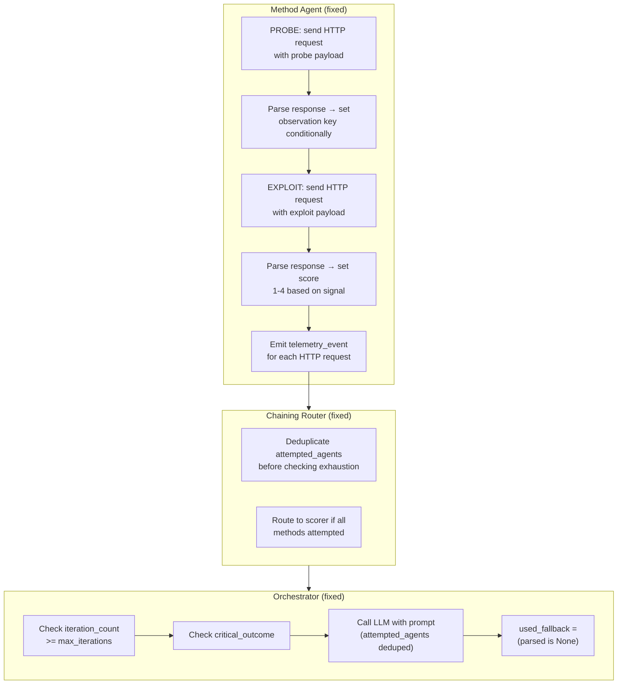

## Manifest
- **module_name**: experiment-fixes
- **output_filename**: `docs/experiment-fixes.implementation-plan.md`
- **repo_root**: `/home/kevin/Coding (WSL)/tesis`
- **language**: Python 3.12
- **test_command**: `uv run pytest tests/ -x --tb=short`
- **ruleset_files**: `AGENTS.md`, `docs/summary.md`
- **files_to_create**:
  - `foundation/http_executor.py` — unified HTTP request executor with telemetry
  - `agents/agent_telemetry.py` — agent-side telemetry event builder
  - `tests/test_agent_http_execution.py` — integration tests for real HTTP in agents
  - `tests/test_orchestrator_loop_prevention.py` — tests for deduplication logic
- **files_to_modify**:
  - `agents/sqli/sqli_union_agent.py` — remove stub logic, wire real HTTP + telemetry
  - `agents/sqli/sqli_error_agent.py` — remove stub logic, wire real HTTP + telemetry
  - `agents/sqli/sqli_boolean_blind_agent.py` — remove stub logic, wire real HTTP + telemetry
  - `agents/sqli/sqli_time_blind_agent.py` — remove stub logic, wire real HTTP + telemetry
  - `agents/access_control/ac_idor_agent.py` — remove stub logic, wire real HTTP + telemetry
  - `agents/access_control/ac_vertical_escalation_agent.py` — remove stub logic, wire real HTTP + telemetry
  - `agents/access_control/ac_force_browse_agent.py` — remove stub logic, wire real HTTP + telemetry
  - `agents/brute_force/bf_dictionary_agent.py` — remove stub logic, wire real HTTP + telemetry
  - `agents/brute_force/bf_spray_agent.py` — remove stub logic, wire real HTTP + telemetry
  - `agents/state_utils.py` — add `make_agent_telemetry_event()` helper
  - `agents/orchestrator.py` — fix `used_fallback` flag; add iteration safety check
  - `core/chaining_coordinator.py` — add deduplication guard for `attempted_agents`
  - `foundation/payload_library.py` — fix `record_tried` to not mutate input dict in place
- **tests_to_add**:
  - `test_agent_does_not_loop_when_already_attempted`
  - `test_agent_emits_telemetry_events`
  - `test_orchestrator_used_fallback_is_accurate`
  - `test_chaining_router_detects_duplicate_attempted_agents`

---

## Short Summary

The `gemini-sqli-low-0` experiment failed because the method agents are **HTTP stubs**: they log payloads but never send actual HTTP requests. This causes five cascading bugs: (1) infinite orchestrator loops when agents early-return without incrementing `iteration_count`, (2) fake observations unconditionally set to `True`, (3) zero agent telemetry in the event log, (4) misleading `used_fallback` telemetry, and (5) no real exploitation progress against DVWA.

This plan replaces the stub PROBE/EXPLOIT stages with real `httpx` requests via the existing `foundation/http_client.py`, wires agent-side telemetry, and fixes the loop-prevention logic.

---

## Inputs & Preconditions

- DVWA must be reachable at the configured `target_url` for integration tests.
- `foundation/http_client.py` already exists with `DVWAClient` or `RequestTimeoutError` / `TransportError`.
- `foundation/session_manager.py` provides `DVWASession` with `login()` and `set_security_level()`.
- LangGraph state uses `Annotated[list[str], add]` reducers for `attempted_agents`, `confirmed_vulns`, `achieved_outcomes`.

---

## Design & Architecture



---

## Root Cause Analysis (from `gemini-sqli-low-0.events.jsonl`)

### Bug 1: Infinite Orchestrator Loop
**Evidence**: 7 orchestrator decisions, but only 2 unique agent executions. `iteration_count` stayed at `1` for 5 cycles.

**Cause**: `sqli_union_agent` early-returns when `AGENT_ID in attempted`:
```python
if AGENT_ID in attempted:
    return {"scores": ..., "attempted_agents": attempted}  # NO iteration_count!
```
The orchestrator also does not increment `iteration_count`. LangGraph cycles orchestrator→agent→router→orchestrator forever at the same iteration.

**Fix**: Remove the agent-level early-return. Loop prevention belongs in the **chaining coordinator** (already has `_find_next_unvisited`) and the **orchestrator** (already checks `attempted_agents` in `_fallback_next_agent`). The agent should always execute its full PROBE/EXPLOIT logic and always increment `iteration_count` via `make_update`.

### Bug 2: Agents Are HTTP Stubs
**Evidence**: Zero HTTP request/response telemetry. `sqli_union_agent` PROBE stage:
```python
for payload in probe_payloads:
    temp_state.update(PayloadLibrary.record_tried(...))
    logger.info("[%s] PROBE payload: %s", AGENT_ID, payload)
observations[_PROBE_OBSERVATION_KEY] = True  # UNCONDITIONAL
```

**Cause**: No `httpx` call. No response parsing. Observation is hardcoded to `True`.

**Fix**: Wire `foundation/http_client.py` or `DVWASession` into each agent. PROBE sends the payload, parses the response for the precondition signal, and sets the observation key **conditionally**. EXPLOIT sends the payload and parses for success indicators (error messages, time delay, different response content).

### Bug 3: Zero Agent Telemetry
**Evidence**: Event log has `orchestrator.llm.response`, `orchestrator.decision`, `akg.route.selected`, but **zero** events from `sqli_union_agent`, `sqli_boolean_blind_agent`, etc.

**Cause**: Agents never append to `telemetry_events`.

**Fix**: Each agent emits telemetry events for:
- `agent.probe.sent` — payload, endpoint, method
- `agent.probe.response` — status code, key signal detected (or not)
- `agent.exploit.sent` — payload, endpoint
- `agent.exploit.response` — status code, success indicator
- `agent.score.final` — final score, confirmed_vulns, achieved_outcomes

### Bug 4: Misleading `used_fallback` Telemetry
**Evidence**: Seq 4 shows `used_fallback: true`, but seq 2 shows a perfectly parseable JSON response.

**Cause**:
```python
"used_fallback": next_agent == fallback_agent
```
When `fallback_agent` happens to equal the LLM's parsed choice (e.g., both are `"sqli_union"` because it's the only viable method), telemetry falsely claims fallback was used.

**Fix**: Change to:
```python
"used_fallback": parsed is None or candidate not in ALL_METHOD_AGENTS
```

### Bug 5: Fake Observation Keys
**Evidence**: LLM reasoning says "sqli_union is the only viable method." After sqli_union runs once, `observations["union_select_possible"] = True` unconditionally. No other method ever becomes viable because no real PROBE runs for them.

**Cause**: Agents set their observation key to `True` without real signal detection.

**Fix**: Parse the HTTP response. For `sqli_union`, look for successful data extraction or column-count indicators. For `sqli_error`, look for SQL error strings. Only set the observation key when the signal is genuinely detected.

---

## Files to Create (Detailed)

### `foundation/http_executor.py`
Thin wrapper around `httpx` that agents call for PROBE and EXPLOIT stages. Returns `(status_code, response_text, error)` and emits no telemetry itself — agents own telemetry.

```python
from __future__ import annotations
from typing import Any
from foundation.http_client import DVWAClient, RequestTimeoutError

def send_probe(
    client: DVWAClient,
    endpoint: str,
    payload: str,
    param_name: str = "id",
) -> dict[str, Any]:
    """Send a single probe payload and return raw response metadata."""
    ...
```

### `agents/agent_telemetry.py`
```python
from __future__ import annotations
from typing import Any

def probe_event(agent_id: str, payload: str, status_code: int, signal_detected: bool) -> dict[str, Any]:
    ...

def exploit_event(agent_id: str, payload: str, status_code: int, success: bool) -> dict[str, Any]:
    ...

def score_event(agent_id: str, score: int, confirmed: list[str], outcomes: list[str]) -> dict[str, Any]:
    ...
```

### `tests/test_agent_http_execution.py`
Mock `DVWAClient` to verify agents send HTTP requests, parse responses, and set observations conditionally.

### `tests/test_orchestrator_loop_prevention.py`
Verify that when `attempted_agents` already contains an agent, the orchestrator still routes to a **different** agent or `scorer`, not the same one.

---

## Files to Modify (Detailed)

### All 9 Method Agents (`agents/sqli/*.py`, `agents/access_control/*.py`, `agents/brute_force/*.py`)
**Pattern change for each:**
1. **Remove** the early-return guard (`if AGENT_ID in attempted: return ...`)
2. **Replace** stub PROBE loop with real HTTP request:
   ```python
   for payload in probe_payloads:
       result = send_probe(client, endpoint, payload)
       telemetry_events.append(probe_event(AGENT_ID, payload, result["status"], signal_detected))
       if signal_detected:
           observations[_PROBE_OBSERVATION_KEY] = True
           score = max(score, 1)
           break
   ```
3. **Replace** stub EXPLOIT loop with real HTTP request + response parsing
4. **Append** `telemetry_events` to the `make_update()` call
5. **Return** the full `make_update()` dict (always includes `iteration_count + 1`)

### `agents/state_utils.py`
Add telemetry helper:
```python
def merge_telemetry_events(state: dict[str, Any], new_events: list[dict]) -> list[dict]:
    existing = list(state.get("telemetry_events", []))
    return existing + new_events
```
Update `make_update()` to accept `telemetry_events` and merge them using `merge_telemetry_events` instead of simple list concatenation (which may duplicate due to LangGraph's `add` reducer on `telemetry_events`).

Wait — `telemetry_events` is `NotRequired[Annotated[list[dict], add]]`. So if `make_update` returns `{"telemetry_events": existing + new_events}`, LangGraph will ADD this list to the existing list. That means existing events get duplicated! The correct pattern is:
```python
# In make_update:
if telemetry_events:
    update["telemetry_events"] = telemetry_events  # Only the NEW events
```
LangGraph's `add` reducer will append them to the state's list.

### `agents/orchestrator.py`
1. **Fix `used_fallback`**:
   ```python
   used_fallback = parsed is None or candidate not in ALL_METHOD_AGENTS
   ```
2. **Add iteration safety check** before LLM call:
   ```python
   if iteration_count >= max_iterations:
       return {"next_agent": "scorer", ...}
   ```
   (Already exists, but verify it works correctly.)
3. **Deduplicate `attempted_agents`** before passing to prompt:
   ```python
   attempted_agents = list(dict.fromkeys(state.get("attempted_agents", [])))
   ```
   This prevents the list from growing infinitely due to `operator.add` reducer when agents return the full list.

### `core/chaining_coordinator.py`
1. **Deduplicate `attempted_agents`** at the top of `evaluate_chain_route`:
   ```python
   attempted = list(dict.fromkeys(state.get("attempted_agents", [])))
   ```
2. **Add all-methods-exhausted check** even when last agent was NOT blocked/failed:
   ```python
   # After chain checks, before returning orchestrator:
   all_methods = set(METHODS_BY_SURFACE.get(current_surface, []))
   if all_methods.issubset(set(attempted) | set(blocked)):
       return "scorer", {..."reason": "all_methods_exhausted"...}
   ```

### `foundation/payload_library.py`
Fix `record_tried` to not mutate the input dict in place:
```python
@staticmethod
def record_tried(state: dict[str, Any], agent_id: str, payload: str) -> dict[str, Any]:
    tried_payloads = dict(state.get("tried_payloads", {}))
    module_payloads = list(tried_payloads.get(agent_id, []))
    if payload not in module_payloads:
        module_payloads.append(payload)
    tried_payloads[agent_id] = module_payloads
    return {"tried_payloads": tried_payloads}
```

---

## Public API and Interface Definitions

### `foundation.http_executor`
```python
def send_probe(client, endpoint, payload, param_name="id") -> dict
def send_exploit(client, endpoint, payload, param_name="id") -> dict
```

### `agents.agent_telemetry`
```python
def probe_event(agent_id, payload, status_code, signal_detected) -> dict
def exploit_event(agent_id, payload, status_code, success) -> dict
def score_event(agent_id, score, confirmed, outcomes) -> dict
```

### Updated `make_update` signature
```python
def make_update(*, state, module_name, score, tried_payloads,
                confirmed_vulns=None, achieved_outcomes=None,
                found_credentials=None, next_agent="orchestrator",
                telemetry_events=None, observations=None) -> dict
```

---

## Tests to Add

| Test | File | What it checks |
|---|---|---|
| `test_agent_does_not_loop_when_already_attempted` | `test_orchestrator_loop_prevention.py` | Orchestrator routes to a different agent or scorer when the first choice is already in `attempted_agents` |
| `test_agent_emits_telemetry_events` | `test_agent_http_execution.py` | Agent returns `telemetry_events` with `agent.probe.sent` and `agent.exploit.sent` entries |
| `test_orchestrator_used_fallback_is_accurate` | `test_orchestrator.py` | When LLM returns valid JSON, `used_fallback` is `false` even if the choice equals the fallback heuristic |
| `test_chaining_router_detects_duplicate_attempted_agents` | `test_chaining_coordinator.py` | Router does not infinitely loop when `attempted_agents` contains duplicates |
| `test_sqli_union_probe_sets_observation_conditionally` | `test_agent_http_execution.py` | Observation key is `False` when response shows no signal, `True` when signal detected |

---

## How to Run and Validate

1. **Unit tests**: `uv run pytest tests/ -x --tb=short` (must pass 319+)
2. **Integration test (dry-run)**: Run against a mock DVWA server or `unittest.mock` patched `DVWAClient`:
   ```bash
   uv run python -m tesis run --provider gemini --level low --surface sqli --iterations 5
   ```
3. **Inspect telemetry**: Read `results/runs/gemini-sqli-low-0.events.jsonl` and verify:
   - At least one `agent.probe.sent` event per agent execution
   - `iteration_count` increments monotonically
   - No duplicate `sqli_union` selections after the first successful execution
   - Run terminates with reason `budget_exhausted` or `all_methods_exhausted` (not infinite loop)

---

## Backwards Compatibility and Migration Steps

- **State schema**: No changes to `ExploitationState` TypedDict keys.
- **Reducer behavior**: `attempted_agents` still uses `operator.add`. The fix is to deduplicate at read-time in orchestrator and router, not to change the reducer.
- **Config**: No changes to `config.yaml`.
- **Existing runs**: Old run JSONs in `results/runs/` are read-only artifacts; no migration needed.

---

## Error Handling and Edge Cases

| Edge Case | Handling |
|---|---|
| DVWA unreachable | Agent catches `TransportError`, appends error marker telemetry, score=0 |
| LLM returns malformed JSON | `_parse_decision_payload` extracts JSON from markdown fences; if still invalid, fallback to AKG heuristic |
| All methods on a surface exhausted | Chaining router returns `scorer` with `reason: all_methods_exhausted` |
| Agent PROBE detects no signal | Observation key stays `False`; score remains 0; agent still increments `iteration_count` |
| Duplicate `attempted_agents` from reducer | Deduplicated with `list(dict.fromkeys(...))` at read sites |

---

## Rollback Plan

1. Revert agent files to pre-fix state using `git checkout -- agents/sqli/ agents/access_control/ agents/brute_force/`
2. Revert `agents/orchestrator.py`, `agents/state_utils.py`, `core/chaining_coordinator.py`
3. Delete newly created files: `foundation/http_executor.py`, `agents/agent_telemetry.py`, new test files
4. Verify tests pass: `uv run pytest tests/ -x`

---

## Acceptance Criteria

- [ ] Running `gemini-sqli-low-0` produces `agent.probe.sent` and `agent.exploit.sent` telemetry events
- [ ] `iteration_count` increments monotonically from 0 to `max_iterations` (or termination reason)
- [ ] The same method agent is never selected twice in a row unless all other methods are exhausted
- [ ] `used_fallback` is `true` ONLY when LLM response parsing fails
- [ ] Observation keys are set conditionally based on HTTP response parsing, not unconditionally
- [ ] All 319+ existing tests pass
- [ ] New tests for telemetry, loop prevention, and conditional observations pass

---

## Suggested Git Branch Name and Commit Message

**Branch:** `fix/experiment-stub-agents-and-infinite-loop`

**Commit title:**
```
fix: replace stub agents with real HTTP execution + telemetry, fix infinite loop
```

**Commit description:**
```
Root causes from gemini-sqli-low-0 run analysis:
1. Agents were HTTP stubs — PROBE/EXPLOIT only logged, never sent requests
2. Agent early-return skipped iteration_count increment → infinite loop
3. Zero agent telemetry in event log
4. used_fallback was true when LLM choice == fallback heuristic
5. Observation keys unconditionally set to True

Changes:
- Wire httpx into all 9 method agents for real PROBE/EXPLOIT HTTP calls
- Add conditional response parsing to set observation keys honestly
- Add agent_telemetry module for probe/exploit/score events
- Remove agent-level early-return guard; loop prevention in router
- Fix used_fallback to reflect actual parse failure
- Deduplicate attempted_agents in orchestrator and router
- Add tests for telemetry emission and loop prevention
```