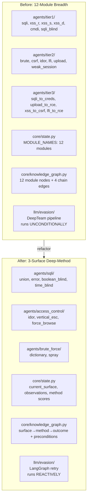
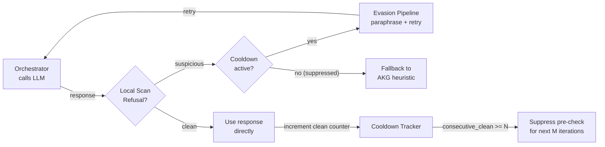

# Implementation Plan: Refactor from 12-Module Breadth to 3-Surface Deep-Method Architecture

## Manifest
- **module_name:** `tesis-framework-scope-refactor`
- **repo_root:** `/home/kevin/Coding (WSL)/tesis`
- **language:** Python 3.12
- **test_command:** `python -m pytest tests/ -v`
- **ruleset_files:** `AGENTS.md`, `docs/summary.md`, `UNIFIED_HANDOFF.md`
- **files_to_create:** 34
- **files_to_modify:** 25
- **tests_to_add:** 8 test modules

---

## Short Summary

Refactor the entire codebase from a 12-module DVWA evaluation framework to a 3-surface deep-method architecture as specified in `docs/summary.md` (post-supervisor revision). This changes:
- **Scope:** 12 modules (SQLi, XSS, CMDi, LFI, Upload, CSRF, Brute, IDOR, Weak Session, etc.) → 3 surfaces (SQL Injection, Access Control, Brute Force) with 4+3+2=9 method agents
- **Agent organization:** `tier1/tier2/tier3` → per-surface folders (`sqli/`, `access_control/`, `brute_force/`)
- **State schema:** Module-level tracking → method-level tracking with `observations`, `current_surface`, `failure_agents`, `akg_path`, `task_result`
- **AKG:** 12 module nodes → 2-level graph (surface → method → outcome) with observable preconditions
- **Scoring:** Binary-ish per-module → method quality metrics (selection accuracy, adaptation rate, attempts-to-success)
- **Evasion:** DeepTeam adversarial injection → LangGraph-native retry pipeline (paraphrase + validity gate), with **reactive trigger** (only on refusal), **short-circuit** (local scan), **cooldown tracker**, and **telemetry fix**
- **Evaluation:** Per-module runner → per-surface runner with `provider × surface × level` matrix

---

## Inputs & Preconditions

**Current state:**
- `core/state.py` has `ExploitationState` with 12 `MODULE_NAMES`, old KG nodes, DeepTeam evasion fields
- `agents/` has `tier1/` (6 agents), `tier2/` (6 agents), `tier3/` (4 chain agents)
- `core/graph_builder.py` registers all 16 runtime agents + 4 chain agents
- `core/knowledge_graph.py` defines transitions for all 12 modules
- `agents/orchestrator.py` maps KG nodes to old agent names; unconditionally runs evasion pipeline on every LLM call
- `foundation/recon.py` infers 12 module names from DVWA URLs
- `foundation/payload_library.py` serves 12 module payload sets
- `llm/prompts/` has 15+ prompt files for old modules
- `llm/evasion/` has DeepTeam integration (pipeline + deepteam_adapters); evasion runs unconditionally on every orchestrator call
- `config.yaml` has evasion enabled, 12-module defaults
- All evaluation infrastructure (runner, reporter, metrics) operates on 12-module schema

**Preconditions before starting:**
- Read and understand `docs/summary.md` Section 4 (project structure) and Section 5 (pseudocode)
- Read `UNIFIED_HANDOFF.md` Section 3 (implementation core) for state schema and AKG structure
- Branch from current `stage-8-jailbreak` (or create new branch)

---

## Design & Architecture



**Key architectural changes:**

1. **State Schema (`core/state.py`):**
   - Remove `MODULE_NAMES` (12 modules)
   - Add `current_surface: str`, `observations: dict`, `failure_agents: list[str]`, `akg_path: list[str]`, `task_result: str | None`, `incomplete_reason: str | None`
   - Change `scores` key from module name to agent_id (method-level)
   - Keep `confirmed_vulns`, `achieved_outcomes`, `found_credentials`, `tried_payloads`
   - Remove DeepTeam evasion fields (`simulator_model`, `simulator_provider`, `max_concurrency`, `successful_evasions`)
   - Add simplified evasion fields: `evasion_enabled: bool`, `evasion_max_retries: int`, `evasion_mode: str` ("reactive" | "proactive")
   - Add `consecutive_clean_responses: int` (for cooldown tracker)

2. **AKG (`core/knowledge_graph.py`):**
   - New node vocabulary: surface nodes (`sqli`, `access_control`, `brute_force`) + method nodes (`sqli_union`, `sqli_error`, etc.) + outcome nodes
   - New method: `get_viable_methods(surface, observations)` — returns method nodes whose preconditions are satisfied
   - Updated cross-surface chains (3 chains only)
   - Removed: all 12 old module nodes, old chain edges

3. **Agent Pipeline (all method agents):**
   - Every method agent follows: PROBE → EXPLOIT → CHAIN CHECK
   - PROBE stage produces `observations` updates (precondition signals)
   - No inline LLM payload generation — payloads from `payload_library.py`

4. **Orchestrator (`agents/orchestrator.py`):**
   - LLM role: method selection (not payload generation)
   - Queries AKG for `viable_methods` given `observations`
   - Excludes `attempted_agents` and `blocked_agents`
   - Falls back to AKG heuristic on guardrail refusal
   - **Evasion is now REACTIVE:** only runs after refusal is detected, not on every call

5. **Chaining Coordinator (`core/chaining_coordinator.py`):**
   - Cross-surface chain routing (3 chains)
   - Fallback loop: blocked/failed → next unexplored method
   - Returns `task_result=INCOMPLETE` with `incomplete_reason` when exhausted

6. **Scorer (`core/scorer.py`):**
   - Surface-level scores (not module-level)
   - New metrics: `method_selection_accuracy`, `adaptation_rate`, `mean_attempts_to_success`
   - Tracks `akg_path` for reproducibility

---

## Evasion Pipeline Design (Reactive + Short-Circuit + Cooldown)

The new evasion pipeline replaces the old unconditional DeepTeam pipeline with a **reactive, lightweight LangGraph-native retry system**.



**5 improvements:**

### 1. Reactive Trigger (not unconditional)
- **Before:** Evasion pipeline ran on EVERY orchestrator LLM call, regardless of response quality
- **After:** Evasion ONLY runs when `guardrail_monitor.check()` detects a refusal
- If no refusal → response used directly, evasion skipped entirely
- Saves ~1-3 LLM API calls per clean response

### 2. Short-Circuit (local pre-check)
- Before entering evasion, run lightweight `guardrail_monitor.check()` (regex/keyword scan for refusal patterns)
- If clean → skip evasion, save API call
- If suspicious → run full evasion pipeline
- This is the SAME `check()` function used for telemetry; no new dependency

### 3. Cooldown / Exhaustion Tracker
- Track `consecutive_clean_responses` in state
- If evasion hasn't triggered in `N` iterations (configurable, default: 5), suppress the pre-check entirely
- This prevents overhead from accumulating across long runs where the model is cooperative
- Reset counter to 0 whenever evasion IS triggered
- Config: `evasion_cooldown_threshold: int` (default: 5)

### 4. Telemetry Fix
- **Before:** `orchestrator.evasion.fallback` event emitted even when evasion wasn't run (misleading)
- **After:**
  - `orchestrator.evasion.skipped` with `reason: "clean_response"` when response is clean
  - `orchestrator.evasion.skipped` with `reason: "cooldown_active"` when suppressed by cooldown
  - `orchestrator.evasion.triggered` when evasion actually runs
  - `orchestrator.evasion.success` / `orchestrator.evasion.failed` when retry succeeds/fails
- Remove the old misleading `"fallback"` status

### 5. Hybrid Mode in Config
- `evasion_mode: "reactive"` (default) — only on refusal, with short-circuit and cooldown
- `evasion_mode: "proactive"` (opt-in) — old behavior: run pipeline on every call (for high-sensitivity models)
- `evasion_mode: "disabled"` — no evasion at all
- Users can keep evasion enabled without paying latency tax on cooperative models (e.g., Gemini at low security)

**Config keys:**
```yaml
evasion:
  enabled: true
  mode: "reactive"          # reactive | proactive | disabled
  max_retries: 3
  cooldown_threshold: 5     # suppress pre-check after N clean responses
```

---

## Files to Create

### New Method Agents (12 files)
1. `agents/sqli/__init__.py`
2. `agents/sqli/sqli_union_agent.py`
3. `agents/sqli/sqli_error_agent.py`
4. `agents/sqli/sqli_boolean_blind_agent.py`
5. `agents/sqli/sqli_time_blind_agent.py`
6. `agents/access_control/__init__.py`
7. `agents/access_control/ac_idor_agent.py`
8. `agents/access_control/ac_vertical_escalation_agent.py`
9. `agents/access_control/ac_force_browse_agent.py`
10. `agents/brute_force/__init__.py`
11. `agents/brute_force/bf_dictionary_agent.py`
12. `agents/brute_force/bf_spray_agent.py`

### New Prompts (9 files)
13. `llm/prompts/sqli_union_prompt.py`
14. `llm/prompts/sqli_error_prompt.py`
15. `llm/prompts/sqli_boolean_blind_prompt.py`
16. `llm/prompts/sqli_time_blind_prompt.py`
17. `llm/prompts/ac_idor_prompt.py`
18. `llm/prompts/ac_vertical_escalation_prompt.py`
19. `llm/prompts/ac_force_browse_prompt.py`
20. `llm/prompts/bf_dictionary_prompt.py`
21. `llm/prompts/bf_spray_prompt.py`

### New Test Files (8 files)
22. `tests/test_state_schema.py`
23. `tests/test_sqli_agents.py`
24. `tests/test_access_control_agents.py`
25. `tests/test_brute_force_agents.py`
26. `tests/test_orchestrator_method_selection.py`
27. `tests/test_chaining_coordinator_fallback.py`
28. `tests/test_scorer_method_metrics.py`
29. `tests/test_evasion_reactive_pipeline.py`

---

## Files to Modify

### Core Infrastructure (5 files)
1. **`core/state.py`** (MAJOR)
   - Remove `MODULE_NAMES`, `MODULE_TO_KG_NODE`, old `KG_NODES`
   - Add new fields: `current_surface`, `observations`, `failure_agents`, `akg_path`, `task_result`, `incomplete_reason`, `consecutive_clean_responses`
   - Update `scores` docstring to use agent_id keys
   - Replace DeepTeam evasion fields with simplified `evasion_enabled`, `evasion_max_retries`, `evasion_mode`
   - Update `DEFAULT_STATE` template

2. **`core/knowledge_graph.py`** (MAJOR)
   - Replace `_build_graph()` with new 3-surface AKG
   - Add `get_viable_methods(surface, observations)` method
   - Update `HIGH_IMPACT_OUTCOMES` to match new outcome nodes
   - Update cross-surface chain edges (3 chains)
   - Remove validation against old `KG_NODES`

3. **`core/graph_builder.py`** (MAJOR)
   - Replace `RUNTIME_AGENT_NODE_NAMES` with 9 new method agents
   - Replace `RUNTIME_AGENT_HANDLERS` imports
   - Remove all tier1/tier2/tier3 agent imports
   - Add imports for new per-surface method agents

4. **`core/chaining_coordinator.py`** (MAJOR)
   - Update `CHAIN_ATTEMPT_MARKERS` for new chain agents (or remove if chains are AKG-native)
   - Update `route_after_agent()` for fallback loop logic
   - Add `find_next_unvisited()` helper
   - Handle `BLOCKED` and `EXECUTION_FAILURE` statuses

5. **`core/scorer.py`** (MAJOR)
   - Replace module-level scoring with surface-level scoring
   - Add method quality metrics computation
   - Update `ScoreSummary` / `ScorerReport` structures

### Agents (2 files)
6. **`agents/base_agent.py`** (MODERATE)
   - Remove `enhance_prompt()` DeepTeam integration
   - Add `probe()` abstract method or helper
   - Update docstrings for method-level (not module-level) agents

7. **`agents/orchestrator.py`** (MAJOR)
   - Replace `KG_NODE_TO_AGENT` mapping with method selection logic
   - Add `get_viable_methods()` query to AKG
   - Update prompt building to include `observations`, `attempted_agents`, `failure_agents`
   - Replace starter agent order with surface-aware selection
   - **Implement reactive evasion:** only call evasion pipeline after guardrail refusal detected
   - **Add short-circuit:** local scan before entering evasion
   - **Add cooldown tracker:** check `consecutive_clean_responses` before pre-check
   - **Fix telemetry:** emit `orchestrator.evasion.skipped` / `.triggered` / `.success` / `.failed`
   - Remove DeepTeam imports

### Foundation (3 files)
8. **`foundation/recon.py`** (MODERATE)
   - Add `observations` derivation: `error_messages_enabled`, `response_diff_detectable`, `response_delay_measurable`, `object_ids_enumerable`, `no_rate_limit`, `low_priv_session_available`
   - Update `DVWA_MODULE_HINTS` to map only 3 surfaces (or keep all for URL inference but only emit 3)

9. **`foundation/payload_library.py`** (MODERATE)
   - Restructure `_PAYLOAD_DB` keys from module names to method names
   - Add per-method payload sets: `sqli_union`, `sqli_error`, `sqli_boolean_blind`, `sqli_time_blind`, `ac_idor`, `ac_vertical_escalation`, `ac_force_browse`, `bf_dictionary`, `bf_spray`

10. **`foundation/verifier.py`** (MINOR)
    - Update to support method-level verification (response diff, delay measurement)
    - Remove XSS-specific Playwright verification (or mark as reserved)

### LLM Layer (4 files)
11. **`llm/provider.py`** (MINOR)
    - Update provider list to match target: Claude, GPT-4o, Open model

12. **`llm/guardrail_monitor.py`** (MINOR)
    - No structural changes needed; keep as-is
    - Ensure `check()` is lightweight (regex/keyword scan)

13. **`llm/prompts/orchestrator_prompt.py`** (MAJOR)
    - Rewrite to support method selection prompt (not module selection)
    - Include `observations`, `viable_methods`, `attempted_agents`, `failure_agents`

14. **`llm/evasion/__init__.py`** (MODERATE)
    - Remove DeepTeam exports
    - Add LangGraph-native retry exports

### Evaluation (4 files)
15. **`evaluation/runner.py`** (MAJOR)
    - Add `surface` parameter to `run_single_engagement()`
    - Update `initial_state` to include `current_surface`, `observations`, etc.
    - Remove DeepTeam evasion parameters
    - Update thread_id pattern to `f"{provider}-{surface}-{level}"`
    - Wire `evasion_mode`, `evasion_max_retries`, `evasion_cooldown_threshold`

16. **`evaluation/multi_llm_runner.py`** (MAJOR)
    - Update matrix to `provider × surface × level`
    - Update result aggregation for surface-level scores
    - Add method quality metrics aggregation

17. **`evaluation/metrics.py`** (MAJOR)
    - Add `method_selection_accuracy()`, `adaptation_rate()`, `mean_attempts_to_success()`
    - Remove module-specific metrics for out-of-scope modules

18. **`evaluation/reporter.py`** (MODERATE)
    - Update report generation for surface-level output
    - Add `akg_path` and method metrics to artifacts
    - Add evasion telemetry events to reports

### CLI / Config (4 files)
19. **`tesis/cli.py`** (MODERATE)
    - Add `--surface` flag to `run` subcommand
    - Update `info` to show 3 surfaces + 9 methods
    - Replace `--evasion-strategy` with `--evasion-mode` (reactive/proactive/disabled)
    - Add `--evasion-max-retries` and `--evasion-cooldown-threshold`

20. **`tesis/config_loader.py`** (MODERATE)
    - Add `surface` config key
    - Add `evasion.mode`, `evasion.cooldown_threshold`
    - Update default models to include Claude, GPT-4o
    - Remove DeepTeam simulator config parsing

21. **`tesis/model_config.py`** (MINOR)
    - Add `surface` field to `EngagementConfig`
    - Replace DeepTeam simulator fields with `evasion_mode`, `evasion_cooldown_threshold`

22. **`config.yaml`** (MODERATE)
    - Update to reflect 3-surface scope
    - Update model configs (Claude, GPT-4o, Open model)
    - Replace evasion section with simplified version:
      ```yaml
      evasion:
        enabled: true
        mode: "reactive"
        max_retries: 3
        cooldown_threshold: 5
      ```

### Project Metadata (2 files)
23. **`pyproject.toml`** (MINOR)
    - Update dependencies if needed (remove deepteam if present)

24. **`AGENTS.md`** (MINOR)
    - Already updated; verify consistency after refactor

---

## Files to Delete (or Deprecate)

**Agent files (out of scope):**
- `agents/tier1/xss_reflected_agent.py`
- `agents/tier1/xss_stored_agent.py`
- `agents/tier1/xss_dom_agent.py`
- `agents/tier1/cmdi_agent.py`
- `agents/tier2/csrf_agent.py`
- `agents/tier2/lfi_agent.py`
- `agents/tier2/upload_agent.py`
- `agents/tier2/weak_session_agent.py`
- `agents/tier3/sqli_to_creds_chain.py`
- `agents/tier3/upload_to_rce_chain.py`
- `agents/tier3/xss_to_csrf_chain.py`
- `agents/tier3/lfi_to_rce_chain.py`

**Prompt files (out of scope):**
- `llm/prompts/xss_reflected_prompt.py`
- `llm/prompts/xss_stored_prompt.py`
- `llm/prompts/xss_dom_prompt.py`
- `llm/prompts/cmdi_prompt.py`
- `llm/prompts/csrf_prompt.py`
- `llm/prompts/lfi_prompt.py`
- `llm/prompts/upload_prompt.py`
- `llm/prompts/weak_session_prompt.py`
- `llm/prompts/xss_to_csrf_chain_prompt.py`
- `llm/prompts/sqli_to_creds_chain_prompt.py`
- `llm/prompts/upload_to_rce_chain_prompt.py`
- `llm/prompts/lfi_to_rce_chain_prompt.py`

**Evasion files (replace with LangGraph-native):**
- `llm/evasion/deepteam_adapters.py`
- `llm/evasion/pipeline.py` (repurpose as LangGraph retry pipeline)

---

## Public API and Interface Definitions

**State contract:**
```python
class ExploitationState(TypedDict):
    target_url: str
    security_level: str  # "low" | "medium" | "high"
    llm_provider: str
    current_surface: str  # "sqli" | "access_control" | "brute_force"
    endpoints: list[dict]
    observations: dict[str, bool]  # precondition signals
    confirmed_vulns: list[str]     # AKG node IDs
    achieved_outcomes: list[str]
    found_credentials: list[dict]
    tried_payloads: dict[str, list[str]]  # agent_id → payloads
    attempted_agents: list[str]
    blocked_agents: list[str]
    failure_agents: list[str]
    akg_path: list[str]
    scores: dict[str, int]  # agent_id → 0-4
    messages: list
    guardrail_activations: list[dict]
    consecutive_clean_responses: int  # for evasion cooldown
    next_agent: str
    iteration_count: int
    max_iterations: int
    task_result: str | None
    incomplete_reason: str | None
```

**AKG interface:**
```python
class AttackKnowledgeGraph:
    def get_viable_methods(self, surface: str, observations: dict) -> list[str]: ...
    def get_next_actions(self, state_node: str) -> list[dict]: ...
    def check_preconditions(self, method_node: str, observations: dict) -> bool: ...
```

**Runner interface:**
```python
def run_single_engagement(
    *,
    target_url: str,
    security_level: str,
    llm_provider: str,
    surface: str,  # NEW
    max_iterations: int = 30,
    evasion_mode: str = "reactive",
    evasion_max_retries: int = 3,
    evasion_cooldown_threshold: int = 5,
) -> dict: ...
```

---

## Tests to Add

1. **`tests/test_knowledge_graph.py`** (update existing)
   - Test `get_viable_methods()` returns correct methods given observations
   - Test cross-surface chain preconditions
   - Test 3-surface node structure

2. **`tests/test_state_schema.py`** (new)
   - Test `DEFAULT_STATE` has all required new fields
   - Test `new_default_state()` returns deep copy
   - Test absence of old `MODULE_NAMES`

3. **`tests/test_sqli_agents.py`** (new)
   - Parametrize all 4 SQLi method agents
   - Test PROBE stage produces correct observations
   - Test EXPLOIT stage updates scores
   - Test CHAIN CHECK appends outcome nodes

4. **`tests/test_access_control_agents.py`** (new)
   - Test all 3 AC method agents

5. **`tests/test_brute_force_agents.py`** (new)
   - Test both BF method agents

6. **`tests/test_chaining_coordinator_fallback.py`** (new)
   - Test fallback loop routes to next unexplored method
   - Test all exhausted returns `scorer` with `incomplete_reason`

7. **`tests/test_orchestrator_method_selection.py`** (new)
   - Test orchestrator queries AKG for viable methods
   - Test excludes attempted/blocked agents
   - Test guardrail fallback to AKG heuristic

8. **`tests/test_scorer_method_metrics.py`** (new)
   - Test `method_selection_accuracy` computation
   - Test `adaptation_rate` computation
   - Test surface-level score aggregation

9. **`tests/test_evasion_reactive_pipeline.py`** (new)
   - Test clean response skips evasion entirely
   - Test refusal triggers evasion pipeline
   - Test cooldown suppresses pre-check after N clean responses
   - Test telemetry emits correct events (`skipped`, `triggered`, `success`)
   - Test proactive mode runs evasion unconditionally
   - Test disabled mode skips all evasion logic

---

## How to Run and Validate

1. **Unit tests:** `python -m pytest tests/ -v`
2. **Type checking:** `python -m mypy core/ agents/ foundation/ llm/ evaluation/ tesis/`
3. **Lint:** `python -m ruff check .`
4. **Integration test (dry-run):**
   ```bash
   python -m tesis run --target http://localhost/dvwa --level low --provider gemini --surface sqli --dry-run
   ```
5. **Single surface run:**
   ```bash
   python -m tesis run --target http://localhost/dvwa --level low --provider gemini --surface sqli
   ```
6. **Matrix run:**
   ```bash
   python -m tesis run --target http://localhost/dvwa --matrix --providers gemini claude --levels low medium high --surfaces sqli access_control brute_force
   ```
7. **Evasion reactive mode test:**
   ```bash
   python -m tesis run --target http://localhost/dvwa --level low --provider gemini --surface sqli --evasion-mode reactive --evasion-cooldown-threshold 3
   ```

---

## Backwards Compatibility and Migration Steps

**Breaking changes:**
- `ExploitationState` schema changes — old run artifacts cannot be loaded
- `MODULE_NAMES` removed — any code referencing it breaks
- Agent names changed — old `next_agent` values in saved states are invalid
- `build_framework()` signature changes (surface parameter)
- Evasion config structure changes (no more `simulator_model`, `simulator_provider`)

**Migration:**
1. Old run artifacts in `results/` are read-only historical data
2. Old state snapshots should be regenerated with new `new_default_state()`
3. Config files need `surface` key and new `evasion` structure
4. No automated migration for saved states — start fresh

---

## Error Handling and Edge Cases

| Edge Case | Handling |
|---|---|
| Unknown surface in config | Validate in `config_loader`; raise `ValueError` with allowed surfaces |
| No viable methods for surface | Orchestrator returns `task_result=INCOMPLETE`, `incomplete_reason=ALL_METHODS_FAILED` |
| All methods blocked by guardrail | Same as above with `incomplete_reason=CONTENT_POLICY` |
| Observation key missing | Treat as `False` (precondition not met) |
| LLM returns invalid JSON | Fallback to AKG heuristic; log to `guardrail_activations` |
| Payload library missing method | Raise `KeyError` with available methods |
| Recon finds no endpoints | Return empty `observations` (all preconditions False) |
| Evasion max retries exhausted | Fallback to AKG heuristic; emit `orchestrator.evasion.failed` |
| Cooldown threshold = 0 | Never suppress pre-check (always scan) |
| Proactive mode + disabled evasion | Proactive mode ignored if `enabled: false` |

---

## Rollback Plan

1. **Git branch:** Create `feature/3-surface-deep-method` from `stage-8-jailbreak`
2. **Incremental commits:** Commit after each major subsystem (state → AKG → agents → graph builder → evaluation → evasion)
3. **Tag before refactor:** `git tag pre-3surface-refactor`
4. **Rollback:** If critical issues found, checkout `pre-3surface-refactor` or revert branch merge
5. **Parallel preservation:** Keep old `agents/tier1/`, `tier2/`, `tier3/` in git history; deletion is reversible

---

## Acceptance Criteria

### Core Architecture
- [ ] `core/state.py` has new `ExploitationState` with `current_surface`, `observations`, `failure_agents`, `akg_path`, `task_result`, `incomplete_reason`, `consecutive_clean_responses`
- [ ] `core/knowledge_graph.py` implements 3-surface AKG with `get_viable_methods()` and 9 method nodes
- [ ] All 9 method agents exist in `agents/sqli/`, `agents/access_control/`, `agents/brute_force/`
- [ ] Each method agent implements PROBE → EXPLOIT → CHAIN CHECK pattern
- [ ] `core/graph_builder.py` registers only 9 method agents + orchestrator + recon + scorer
- [ ] `agents/orchestrator.py` selects methods via AKG + LLM (not modules)
- [ ] `core/chaining_coordinator.py` routes fallback loop correctly
- [ ] `core/scorer.py` computes method quality metrics (selection accuracy, adaptation rate)

### Foundation
- [ ] `foundation/recon.py` produces `observations` dict with precondition signals
- [ ] `foundation/payload_library.py` serves per-method payloads

### Evaluation
- [ ] `evaluation/runner.py` accepts `surface` parameter
- [ ] `evaluation/multi_llm_runner.py` runs `provider × surface × level` matrix
- [ ] `evaluation/metrics.py` computes method quality metrics

### Evasion Pipeline (Reactive)
- [ ] Evasion only triggers AFTER guardrail refusal is detected (not unconditionally)
- [ ] Local `guardrail_monitor.check()` runs before evasion as short-circuit
- [ ] Cooldown tracker suppresses pre-check after `N` consecutive clean responses
- [ ] Telemetry emits `orchestrator.evasion.skipped` / `.triggered` / `.success` / `.failed`
- [ ] Config supports `evasion_mode: reactive | proactive | disabled`
- [ ] DeepTeam integration removed from orchestrator and base agent

### CLI / Config
- [ ] CLI supports `--surface` flag
- [ ] CLI supports `--evasion-mode`, `--evasion-max-retries`, `--evasion-cooldown-threshold`
- [ ] `config.yaml` uses new `evasion:` structure (no DeepTeam fields)

### Quality
- [ ] All tests pass (`pytest tests/ -v`)
- [ ] Dry-run succeeds: `python -m tesis run --dry-run --surface sqli`
- [ ] Out-of-scope agents and prompts removed or deprecated
- [ ] `AGENTS.md` and `docs/summary.md` remain consistent with code

---

## Suggested Git Branch Name and Commit Message

**Branch:** `feature/3-surface-deep-method-refactor`

**Commit message structure (incremental):**
```
refactor: Migrate from 12-module breadth to 3-surface deep-method architecture

- Restructure agents/ from tier1/tier2/tier3 to sqli/access_control/brute_force
- Add 9 method agents with PROBE→EXPLOIT→CHAIN CHECK pipeline
- Update state schema: current_surface, observations, failure_agents, akg_path
- Rewrite AKG with 2-level nodes (surface→method) and precondition semantics
- Update orchestrator for method-level LLM selection over AKG
- Add fallback loop to chaining coordinator
- Update scorer with method quality metrics
- Remove out-of-scope modules (XSS, CMDi, LFI, Upload, CSRF, Weak Session)
- Replace DeepTeam evasion with reactive LangGraph-native retry pipeline:
  - Only triggers on guardrail refusal (not unconditionally)
  - Short-circuit: local scan before entering evasion
  - Cooldown tracker: suppress pre-check after N clean responses
  - Fix telemetry: emit .skipped / .triggered / .success / .failed
  - Config: evasion_mode reactive | proactive | disabled
- Update evaluation runner for per-surface execution

Co-authored-by: factory-droid[bot] <138933559+factory-droid[bot]@users.noreply.github.com>
```
