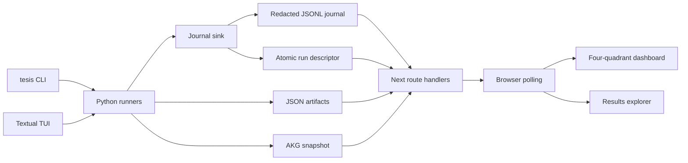

# TESIS Web Observer and Artifact Explorer

Status: **Plan only. Implementation intentionally not started.**

## Scope and decisions

Create a separate Next.js project at `/home/kevin/coding/tesis-web` and add a
small filesystem observation layer to the existing Python repository at
`/home/kevin/coding/tesis`.

The website will be observer-only in the first release. Users continue to
start experiments with the existing `python -m tesis run` or headless CLI. The
website discovers active runs, replays/tails redacted runtime events, and
opens a detailed results page after completion. It will not launch, cancel, or
mutate experiments.

The integration will use a local filesystem event journal rather than a new
Python HTTP server. Next.js route handlers will act as a read-only local
adapter over `TESIS_ROOT/results/runs`. The browser will never read arbitrary
paths or raw credentials.

## Runtime and data flow



The existing canonical graph, static AKG, payload validation, containment,
verifier behavior, scoring, CLI flags, and artifact schema remain
authoritative. The website consumes `RunEvent.as_dict()` and completed
artifact data instead of reimplementing runtime decisions.

## Backend changes in `tesis`

### 1. Runtime journal

Add a UI-independent runtime journal implementation near
`tesis/runtime_events.py`.

- Add a thread-safe JSONL sink that writes one redacted
  `RunEvent.as_dict()` per line.
- Add a small multiplexing sink so existing UI callbacks and the journal
  receive the same event exactly once.
- Flush after each event and tolerate a reader opening while a line is being
  written. Keep existing enriched `.events.jsonl` behavior unchanged.
- Never write API keys, cookies, passwords, tokens, or unredacted provider
  configuration to the journal.

### 2. Live-run descriptor and AKG snapshot

Add a live-run descriptor/helper module, for example
`tesis/live_runtime.py`.

- Write an atomically replaced `runtime.json` before execution with protocol
  version, mode, experiment directory, logical/physical IDs when known,
  coordinate metadata, start timestamp, and `status: active`.
- Maintain terminal status from `run.finished`, `run.cancelled`,
  `run.failed`, `matrix.finished`, or an abnormal stale heartbeat.
- Store the append-only journal as `runtime.events.jsonl` in the experiment
  directory. Matrix events from the parent and child coordinates use one
  ordered parent journal, while child artifact paths remain discoverable from
  `experiment.manifest.json`.
- Export a static AKG snapshot for the experiment. Include node IDs, node
  types, surfaces, methods, payload profiles/target parameters, and edge
  metadata such as chain status, preconditions, target agent, and priority.
  The exporter must be read-only and deterministic.

### 3. Wire existing execution entrypoints

Wire the journal into both existing execution entrypoints.

- Update `tesis/headless.py` to create the journal around the allocated layout
  and pass the multiplexed `event_sink` into `run_single_engagement` or
  `run_provider_matrix`.
- Update the runtime thread in `tesis/tui.py` to multiplex its current
  dashboard callback with the journal sink, so `python -m tesis run` is
  observable without changing the TUI.
- Ensure cleanup writes a terminal descriptor even when configuration, runner,
  manifest, or provider setup fails.
- Preserve cooperative cancellation and existing artifact identity:
  `execution_id`, `run_id`, and `config_fingerprint` are unchanged.
- Keep journal creation local and opt-out only for tests or explicitly
  disabled integrations, not for normal CLI/TUI runs.

### 4. Backend tests and fixtures

Add backend tests and fixtures for:

- Journal ordering and concurrent emission.
- Secret redaction, malformed/partial trailing JSONL handling, and
  cursor-based reads.
- Atomic descriptor transitions for success, error, and cancellation.
- Stable AKG snapshot shape and edge metadata.
- Headless/TUI runner wiring with a fake sink, without contacting DVWA or an
  LLM.
- Existing artifact and runner tests continuing to pass.

## Separate Next.js project at `tesis-web`

Bootstrap an App Router TypeScript project with Tailwind CSS and shadcn/ui.
Add `@xyflow/react` for the AKG visualization, `lucide-react` for icons,
`zod` for validating adapter payloads, and a small date/formatting utility if
needed. Configure `TESIS_ROOT` to point to the Python repository, defaulting
to `/home/kevin/coding/tesis` for local development.

### Server adapter routes

Implement read-only route handlers under `app/api`:

- `GET /api/runtime/runs`: scan descriptors and manifests below
  `TESIS_ROOT/results/runs`, returning active and recent single/matrix runs
  with safe metadata.
- `GET /api/runtime/runs/[executionId]`: resolve a run by execution ID,
  descriptor, manifest, or artifact repository metadata.
- `GET /api/runtime/runs/[executionId]/events?cursor=N`: read complete JSONL
  lines after a byte cursor, returning `events`, `nextCursor`, `status`, and
  `hasMore`. Ignore an incomplete final line until the next poll.
- `GET /api/results/[executionId]`: load the completed single artifact or
  matrix aggregate and normalize it into a frontend result contract. For
  matrix results, include coordinate summaries and resolvable child
  artifacts.
- `GET /api/results/[executionId]/coordinates/[runId]`: load one matrix child
  artifact for the detailed coordinate view.
- `GET /api/akg`: return the deterministic AKG snapshot, preferably from the
  selected run directory and otherwise from a checked-in/generated static
  snapshot.

Use strict path resolution under `TESIS_ROOT`, reject traversal, ignore
malformed files, apply an explicit response allowlist, and re-redact
sensitive fields before returning JSON. Bind the local development server to
localhost. Do not expose arbitrary filesystem reads or process controls.

Define shared TypeScript schemas/types for `RunEvent`, run descriptors,
manifests, normalized artifacts, evidence rows, and the six thesis score
dimensions. The adapter should preserve full redacted prompt/response
content for the detail drawer while excluding secrets and raw
credential-bearing configuration.

### Live dashboard page

Implement `/` as a runtime monitor with a purposeful dark industrial
observability aesthetic, not a generic admin template. Use a near-black
graphite canvas, warm amber for active traversal, cyan for model activity,
lime for confirmed findings, and red only for failures/containment. Pair a
distinctive condensed display face with a highly legible technical body face,
add subtle grid/noise texture, restrained scanline motion, clear focus states,
and compact dense data presentation.

Use an explicit four-quadrant CSS grid on desktop, with responsive vertical
stacking on smaller screens:

#### 1. Top-left, AKG traversal

- React Flow graph from the static snapshot.
- Color node states as unknown, active, visited, confirmed, blocked, or
  chain-enabled.
- Highlight the current node/edge from `graph.node.*`,
  `akg.route.selected`, `graph.state`, `selected_method`, `akg_path`,
  `confirmed_vulns`, and `achieved_outcomes`.
- Provide zoom, fit-to-view, legend, and a compact “current route”
  breadcrumb.

#### 2. Top-right, runtime coordinate

- Status, elapsed time, start/end timestamps, execution ID, run ID,
  provider/model, surface, security level, experiment condition, payload
  mode, target method, current node, selected method, viable methods,
  iteration, and chain/path.
- Display a live connection badge showing waiting, active, stale, completed,
  cancelled, or error.
- Keep target scope visible as the configured DVWA host/path, without
  exposing credentials.

#### 3. Bottom-left, LLM conversation and trace

- Render actual redacted LLM events grouped by role/call, including
  system/user prompt summaries, streamed response text, structured response,
  parse status, model timing, token usage, cache hit, guardrail handling,
  fallback, and invalid JSON events.
- Keep token chunks coalesced client-side to avoid excessive renders, while
  retaining the full event journal for replay.
- Allow expand/collapse per call and a “trace” mode for
  graph/payload/probe events. Use monospace formatting and clear role chips.

#### 4. Bottom-right, outcomes and budget

- Metric cards for successes, failures, containment events, guardrail
  activations/rate, invalid JSON, fallbacks, attempts, candidates
  accepted/rejected, remaining candidate budget, remaining iterations, token
  usage/cost, and matrix progress.
- Add small sparklines or progress bars for budget and guardrail rate, with
  explicit denominators.
- Make containment and guardrail activity prominent but distinguish
  containment violations from normal blocked external navigation evidence.

The dashboard should begin in a waiting state with instructions to start the
existing backend/CLI. It should automatically adopt the newest active
descriptor, replay the journal from cursor zero, then poll for new events at
a bounded interval. When a terminal event and artifact become available, show
a clear “Open detailed results” action and retain the live trace.

### Results pages

Implement `/results/[executionId]` with a results header, status badge,
timestamps, coordinate metadata, artifact identity, confirmed
vulnerabilities, achieved outcomes, target scope, and a compact executive
summary. Use tabs or segmented controls for single-run versus matrix context,
evidence, and trace, but keep the two required tables visually primary.

#### 1. Detailed experiment table

For a selected single run or selected matrix coordinate, render one row per
meaningful execution event/evidence record, not raw JSON.

Columns:

- Timestamp
- Graph node/phase
- Method or route
- Action/prompt label
- Candidate/parameter
- Result/status
- Evidence/signal
- Safety marker

Expand a row into a side panel containing the full redacted prompt/response,
structured LLM data, payload provenance, validation decision,
response/timing evidence, verifier decision, and related event IDs.

Include event-type, node/method, success/failure/safety, and timestamp
filters. For matrix mode, add a coordinate selector and compact coordinate
index so the same detailed table can inspect every child without loading the
whole matrix into one oversized DOM tree.

#### 2. Thesis scoring table

Use exactly the thesis dimensions as rows:

- `Smethod`
- `Spayload`
- `Sexploit`
- `Schain`
- `Soutput`
- `Srun`

Columns:

- Dimension
- Score
- Maximum
- Evidence basis
- Interpretation

Render the composite formula explicitly:

```text
Srun = 0.20*Smethod + 0.20*Spayload + 0.30*Sexploit
       + 0.10*Schain + 0.20*Soutput
```

Show every dimension separately, with no score inferred from LLM claims.

In matrix mode, provide a second view of the same scoring table as coordinate
rows with the six score columns, status, and selected method, while retaining
a click-through to the detailed coordinate table.

Include thesis metric summaries beside the table, including payload
validity/execution/improvement rates, method selection accuracy, adaptation
rate, guardrail activation rate, containment count, attempts to success, and
token cost.

Add an artifact download control for the original redacted JSON and a
readable Markdown-style evidence export, but keep those secondary to the
tables.

## Frontend component structure

Use components along these boundaries:

- `components/runtime/runtime-shell.tsx`
- `components/runtime/akg-graph.tsx`
- `components/runtime/coordinate-panel.tsx`
- `components/runtime/conversation-panel.tsx`
- `components/runtime/outcome-panel.tsx`
- `components/results/detail-table.tsx`
- `components/results/scoring-table.tsx`
- `components/results/coordinate-index.tsx`
- `components/results/evidence-drawer.tsx`
- `lib/api-client.ts`
- `lib/event-reducer.ts`
- `lib/result-normalizer.ts`
- `lib/formatters.ts`
- `lib/schemas.ts`

Use shadcn primitives for cards, badges, tabs, tables, drawers/sheets, scroll
areas, tooltips, separators, progress, and command-style filtering.

Centralize event reduction so dashboard state is derived monotonically from
the event stream and final artifact. The reducer must not overwrite confirmed
findings or achieved outcomes with stale `graph.state` snapshots. It must
keep event order, cursor, stale detection, and matrix coordinate counters
explicit.

## Validation and acceptance criteria

- `python -m tesis run --dry-run --config config.yaml` still passes.
- Existing Python tests pass, plus the new journal, descriptor, AKG export,
  and integration tests.
- The website starts independently with documented `TESIS_ROOT` configuration
  and shows an empty/waiting state when no runtime is active.
- Starting either the existing TUI or headless CLI produces a discoverable
  descriptor, redacted live journal, and unchanged canonical artifacts.
- Opening the website during a run shows all four quadrants updating,
  including current AKG traversal, coordinate metadata, actual redacted LLM
  conversation, safety events, counts, and remaining budgets.
- Reloading during a run resumes from the journal cursor without duplicate or
  malformed rows.
- Completion transitions to the results page for both single and matrix runs.
- The detailed table exposes timestamps, nodes, chain/traversal,
  prompts/responses, payload provenance, validation, evidence, verifier
  decisions, and safety events without requiring JSON inspection.
- The scoring table preserves all six thesis dimensions and the composite
  formula, with matrix coordinate comparison available.
- Credentials and session data never appear in journal files, API responses,
  logs, or rendered UI.
- No website action changes the DVWA target, runtime configuration, AKG,
  artifacts, or experiment execution.

## Source references

- `AGENTS.md`
- `README.md`
- `docs/architecture.md`
- `docs/summary_en.md`
- `tesis/runtime_events.py`
- `tesis/headless.py`
- `tesis/tui.py`
- `tesis/artifact_repository.py`
- `tesis/artifact_layout.py`
- `evaluation/runner.py`
- `evaluation/multi_llm_runner.py`
- `core/knowledge_graph.py`
- `core/scorer.py`
- `evaluation/metrics.py`
